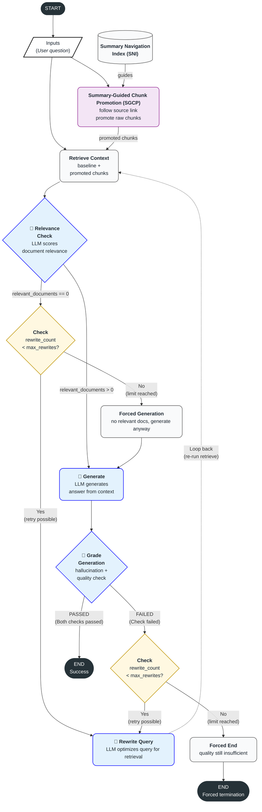
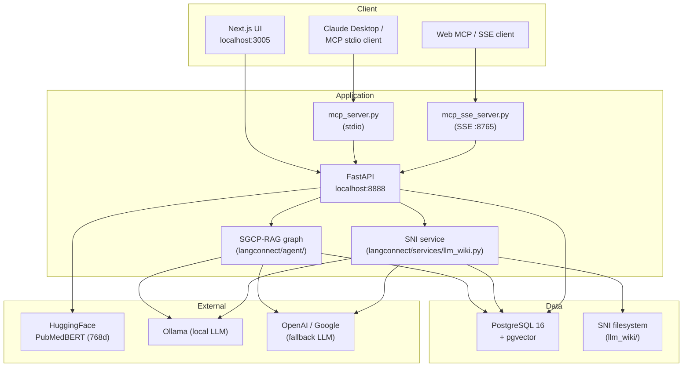

# SGCP-RAG

> **SGCP-RAG: a self-correcting, SNI-guided search graph, with MCP integration and a Next.js GUI.**

`SGCP-RAG` (**S**ummary-**G**uided **C**hunk **P**romotion RAG) is a full-stack RAG (Retrieval-Augmented Generation) system built on PostgreSQL + `pgvector`. You upload documents into collections; they are automatically parsed, chunked, embedded, and searchable. Every collection also gets a **self-rebuilding SNI** (Summary Navigation Index) — a markdown knowledge base — and queries run through the SGCP-RAG search graph: a self-correcting retrieve → grade → generate → grade loop that uses the SNI to promote real source chunks ahead of grading, rather than answering from the SNI's summaries directly. Everything is exposed simultaneously via a Next.js UI, a REST API, and an MCP (Model Context Protocol) server.

This project is a fork of [`teddynote-lab/langconnect-client`](https://github.com/teddynote-lab/langconnect-client) (itself based on LangChain AI's [`langconnect`](https://github.com/langchain-ai/langconnect)) extended with:

- **SGCP-RAG** — a LangGraph-based, SNI-guided self-correcting search graph,
- a **per-collection SNI** inspired by [Karpathy's gist](https://gist.github.com/karpathy/442a6bf555914893e9891c11519de94f), which SGCP-RAG builds and reads,
- **Ollama-first LLM routing** with graceful OpenAI/Google fallback,
- domain-specific **PubMedBERT** embeddings.

---

## Table of Contents

1. [Overview — What this project does](#1-overview--what-this-project-does)
2. [SGCP-RAG — the self-correcting search graph](#2-sgcp-rag--the-self-correcting-search-graph)
3. [The SNI — Karpathy's idea, adapted for SGCP-RAG](#3-the-sni--karpathys-idea-adapted-for-sgcp-rag)
4. [Architecture](#4-architecture)
5. [Quick Start](#5-quick-start)
6. [Usage in Detail](#6-usage-in-detail)
   - [6.1 Using the Web UI](#61-using-the-web-ui)
   - [6.2 Using the REST API](#62-using-the-rest-api)
   - [6.3 The SGCP-RAG Search API](#63-the-sgcp-rag-search-api)
   - [6.4 The SNI API](#64-the-sni-api)
   - [6.5 Using the MCP server](#65-using-the-mcp-server)
7. [Environment variables](#7-environment-variables)
8. [Testing](#8-testing)
9. [License](#9-license)

---

## 1. Overview — What this project does

`SGCP-RAG` bundles three responsibilities into one system:

| Capability | What it does |
|------------|--------------|
| **RAG infrastructure** | Upload PDF / DOCX / HTML / TXT / MD → parse with PyMuPDF4LLM → chunk → embed with PubMedBERT (768-dim) → store in PostgreSQL `pgvector` → search via semantic / keyword / hybrid. |
| **SGCP-RAG search** | A LangGraph `StateGraph` runs a self-correcting loop: SNI-guided chunk promotion → retrieve → grade documents → generate → grade for hallucination & answer quality → rewrite the query and retry on failure. |
| **SNI metadata layer** | An LLM automatically summarises and categorises every document in a collection into markdown pages (`llm_wiki/collections/{collection_id}/`) plus a runtime JSON pack. Rebuilds happen automatically on upload/delete. This is the artifact SGCP-RAG promotes chunks from (togglable via `use_wiki_context`). |

`SGCP-RAG` names the whole method: **S**ummary-**G**uided **C**hunk **P**romotion RAG. An SNI page's summary points the search graph back to the *real* source chunks it summarises, instead of letting the summary itself answer the question (`SNI_LLM_*` env vars in [§7](#7-environment-variables) configure the SNI rebuild LLM). See [§2.2](#22-sgcp-rag-in-this-project) for the full execution-flow diagram and [§3.3](#33-the-key-design-decision--sni-is-navigation-not-evidence) for why this distinction matters.

Three independent entry points access the same backend:

- **Next.js Web UI** — `http://localhost:3005` (Docker) / `http://localhost:3893` (local `npm run dev`, see [§5](#5-quick-start))
- **REST API** — `http://localhost:8888` (Swagger UI at `/docs`)
- **MCP server** — `mcpserver/mcp_server.py` (stdio) or `mcpserver/mcp_sse_server.py` (SSE on port 8765)

---

## 2. SGCP-RAG — the self-correcting search graph

### 2.1 The problem with naive RAG

A traditional RAG pipeline is unidirectional:

```
question → retrieve → generate → answer
```

This has two well-known weaknesses:

- Retrieved documents that are **irrelevant to the question** are still fed to the generator, degrading answer quality.
- If the LLM **hallucinates content not present in the documents**, there is no detection mechanism.

### 2.2 SGCP-RAG in this project

SGCP-RAG addresses both weaknesses with a self-correcting LangGraph `StateGraph`: conditional routing and self-grading loops decide whether retrieved documents are relevant and whether the generated answer is grounded in them, rewriting the query and retrying retrieval whenever either check fails. On top of that self-correcting loop — **simplified for a single-vectorstore environment** and **hardened with production safety guards** — SGCP-RAG folds in SNI-guided chunk promotion ahead of grading. The combination — SNI construction, SGCP promotion, and the self-correcting retrieve/grade/generate/grade/rewrite loop — is what this project calls **SGCP-RAG**. The implementation lives in `langconnect/agent/`.



Loop guard: if `rewrite_count >= max_rewrites`, force-terminate (generate from whatever was retrieved, or end with a "forced termination" status if quality is still insufficient).

Differences from the original Adaptive RAG notebook ([LangChain `07-LangGraph-Adaptive-RAG`](https://github.com/teddynote-lab/langchain-kr)):

| Change | Why |
|--------|-----|
| Removed the `route_question` (web vs vectorstore) branch. | MCP clients are assumed to bring their own web search. The graph stays inside a single trust boundary: the vectorstore. |
| Added an explicit `rewrite_count` / `max_rewrites` counter. | Replaces the notebook's reliance on `recursion_limit` so we avoid `GraphRecursionError` and keep a hard token budget. |
| Separated `relevant_documents` from `documents` in state. | The notebook overwrites `documents` after filtering; we keep both so the trace can show what was filtered out. |
| Bound the LLM with `functools.partial(node, llm=llm)`. | Avoids the LangGraph state-serialisation issue you get from stuffing an LLM instance into state, and lets tests inject mocks trivially. |
| Reused the existing `Collection.search()` instead of a new retriever tool. | 100% reuse of the existing hybrid-search infrastructure — zero retrieval-code duplication. |
| Added the SGCP promotion step ahead of grading. | Lets a question whose vocabulary doesn't match the source text still retrieve the right chunk, via the SNI's concept-level summary. |

> For the deeper mapping see `docs/design-decisions-agentic-rag.md`; for the full graph see `docs/agenticRAG_architecture.md`.

---

## 3. The SNI — Karpathy's idea, adapted for SGCP-RAG

### 3.1 The original idea

In [his gist](https://gist.github.com/karpathy/442a6bf555914893e9891c11519de94f), Andrej Karpathy proposes the following:

> *While an LLM works on a task, have it continuously write down what it just learned — recurring patterns, gotchas, useful shortcuts — into a markdown wiki. Inject that wiki back as context in future sessions and the assistant becomes incrementally smarter. In short, **a living human-readable knowledge base for an AI coding assistant**.*

The appeal is that (1) the artefact is plain markdown and stays human-inspectable, (2) humans can audit and edit it, and (3) it is a **concept-level navigation index** rather than another opaque embedding store.

### 3.2 How this project applies the idea

We bring Karpathy's wiki idea down to the **RAG collection** level as the SNI — one SNI per collection.

```
llm_wiki/
└── collections/
    └── {collection_id}/
        ├── sources/           # one summary page per original document (.md + YAML frontmatter)
        ├── concepts/          # cross-cutting concepts extracted by the LLM (.md)
        ├── SCHEMA.md          # frontmatter schema documentation
        ├── index.md           # catalog grouped by sources + concepts
        ├── manifest.json      # page metadata + runtime pack path
        └── log.md             # report of the latest successful rebuild
    {collection_id}.json       # ← runtime JSON pack consumed by agentic_search
```

**Automatic rebuild triggers:**

- Right after a successful document upload (`POST /collections/{id}/documents`), unless the caller explicitly opts out (see `rebuild_wiki` in [§6.2](#62-using-the-rest-api)).
- Right after a document deletion (`DELETE /collections/{id}/documents/...`).
- On explicit demand (`POST /collections/{id}/llm-wiki/rebuild` or the MCP tool `rebuild_llm_wiki`).

### 3.3 The key design decision — SNI is *navigation*, not *evidence*

Karpathy's original wiki is injected directly into the prompt and the LLM treats it as ground truth. Doing that naively inside a RAG system would be a disaster: the SNI's *summaries* would silently become the evidence backing each answer, and your citation / hallucination grading would no longer reflect reality. We deliberately rule that out (`docs/llm-wiki-context.md`):

> *"LLM Wiki context is an optional navigation layer. It is not a source of truth, not citation evidence, and not a raw generation prompt channel."*

Instead, we only trust the SNI page's `source_refs` — coordinates back to real chunks. This is the **SGCP** promotion step within the **SGCP-RAG** execution graph shown in [§2.2](#22-sgcp-rag-in-this-project): SNI page selection promotes `source_refs` (capped at 8) into the same `retrieve()` result set used by grading, deduplicated by `chunk_id`. `generate()` and the hallucination grader only ever see promoted *real* chunks — SNI page titles/summaries/keywords are returned as response metadata only and never enter the evidence set.

The net effect:

- The SNI acts as a **human-readable index** describing what the collection covers.
- It simultaneously serves as a **retrieval-boost signal**: even when a question uses different vocabulary than the source text, the concept page can pull in the right chunk.
- The hallucination grader always operates on a consistent set of raw chunks.

### 3.4 Page schema (summary)

Each SNI page (`sources/*.md`, `concepts/*.md`) carries a typed YAML frontmatter:

```markdown
---
title: STAgent
type: concept                    # source | concept
summary: Interprets pancreatic beta cell maturation across timepoints.
keywords: [single-cell, biological interpretation]
source_refs:
  - {file_id: paper-a, chunk_id: chunk-a-3}
  - {file_id: paper-b, chunk_id: chunk-b-7}
generated_at: 2026-05-19T12:34:00Z
updated_at: 2026-05-19T12:34:00Z
confidence: medium               # low | medium | high
---

(LLM-generated markdown body)
```

The runtime JSON pack (`llm_wiki/collections/{id}.json`) is a compressed index built from those frontmatters so `agentic_search` can do fast page selection without parsing markdown.

### 3.5 Document quality checks on upload

Two additional checks run as part of the upload pipeline, independent of embedding/indexing:

- **Paper Card extraction** (`langconnect/services/paper_cards.py`, `langconnect/models/paper_card.py`) — a heuristic check that an uploaded document actually parsed into a well-formed paper: a real title, an abstract of reasonable length, an author block. Failures don't block the upload; they surface as `paper_card_warnings` in the upload response so you know a file may need re-parsing or manual cleanup.
- **Markdown conversion quality** (`langconnect/services/pdf_markdown_quality.py`, `langconnect/parsers/pdf_markdown_cleanup.py`) — scores the PyMuPDF4LLM PDF→Markdown conversion itself (headings, tables, images, links detected; whether an Abstract/References section was found) to flag conversions that likely lost structure.

---

## 4. Architecture



| Component | Location |
|-----------|----------|
| FastAPI server | `langconnect/server.py` |
| Collections / Documents API | `langconnect/api/collections.py`, `langconnect/api/documents.py` |
| SGCP-RAG Search API | `langconnect/api/agentic.py` |
| SNI API | `langconnect/api/llm_wiki.py` |
| SGCP-RAG graph | `langconnect/agent/{state,nodes,graders,prompts,graph,wiki_context,query_expansion,config}.py` |
| SNI rebuild service | `langconnect/services/llm_wiki.py` |
| Document parsing, chunking & quality checks | `langconnect/services/document_processor.py`, `langconnect/services/paper_cards.py`, `langconnect/services/pdf_markdown_quality.py`, `langconnect/parsers/` |
| MCP stdio server | `mcpserver/mcp_server.py`, `mcpserver/base_mcp_server.py` |
| MCP SSE server | `mcpserver/mcp_sse_server.py` |
| Next.js frontend | `next-connect-ui/` |

For full diagrams and sequence flows, see `docs/architecture-overview.md`, `docs/agenticRAG_architecture.md`, and `docs/llm-wiki-context.md`.

---

## 5. Quick Start

### 5.1 Prerequisites

- Docker & Docker Compose
- (optional) Node.js 20+ — for the MCP Inspector or local frontend dev
- (optional) Python 3.11+ with `uv` — for local backend dev or running the MCP stdio server outside Docker
- (optional) [Ollama](https://ollama.com/) — for local LLM inference (the agent automatically falls back to OpenAI/Google if Ollama is unreachable)

### 5.2 Configure `.env`

```bash
cp .env.example .env
```

At minimum, fill in `OPENAI_API_KEY`. The rest of `.env.example` already has working local-dev defaults:

```dotenv
# Embeddings (PubMedBERT runs locally; OPENAI_API_KEY is only needed for OpenAI fallback)
OPENAI_API_KEY=sk-...

# Query expansion: tries Ollama first, falls back to OpenAI
QUERY_EXPANSION_LLM_BASE_URL=http://localhost:11434
QUERY_EXPANSION_LLM_PROVIDER=auto
QUERY_EXPANSION_LLM_MODEL=qwen3.5:9b
QUERY_EXPANSION_OPENAI_MODEL=gpt-5.4-mini

# SGCP-RAG: tries Ollama first, falls back to OpenAI
AGENT_LLM_BASE_URL=http://localhost:6000
AGENT_LLM_PROVIDER=auto
AGENT_LLM_MODEL=qwen3.5:122b
AGENT_LLM_OPENAI_MODEL=gpt-5.4

# SNI rebuild: tries Ollama first, falls back to OpenAI
SNI_LLM_PROVIDER=auto
SNI_LLM_BASE_URL=http://host.docker.internal:11434
SNI_LLM_MODEL=qwen3.5:397b-cloud
SNI_LLM_OPENAI_MODEL=gpt-5.4-mini
SNI_LLM_TEMPERATURE=0

# PostgreSQL
POSTGRES_USER=llmwiki
POSTGRES_PASSWORD=llmwiki
POSTGRES_DB=llmwiki_rag_db

# Next.js
NEXTAUTH_SECRET=change-me
```

> `.env.example` does not set a shared `OLLAMA_BASE_URL` — each subsystem (`AGENT_LLM_BASE_URL`, `QUERY_EXPANSION_LLM_BASE_URL`, `SNI_LLM_BASE_URL`) points at Ollama independently, since they may run against different hosts/tunnels. Set `OLLAMA_BASE_URL` yourself only if you want one shared fallback endpoint across all three (see [§7](#7-environment-variables)).

A complete variable reference is in [§7](#7-environment-variables).

### 5.3 Build and run

```bash
make build       # build the Next.js bundle + Docker images
make up          # start postgres + api + nextjs
make down        # stop everything
make restart     # bounce the stack
docker-compose logs -f   # tail logs
```

Once up:

| Service | URL |
|---|---|
| Next.js UI | http://localhost:3005 |
| API | http://localhost:8888 |
| API docs (Swagger) | http://localhost:8888/docs |
| Health check | http://localhost:8888/health |
| Postgres | localhost:5432 |

For local (non-Docker) frontend development instead:

```bash
cd next-connect-ui
npm run dev     # http://localhost:3893
```

### 5.4 Generate the MCP config

```bash
make mcp
```

This writes `mcpserver/mcp_config.json`. Paste its contents into Claude Desktop / Cursor's MCP settings.

---

## 6. Usage in Detail

### 6.1 Using the Web UI

1. Open `http://localhost:3005`.
2. **Collections** page → create a new collection (name + optional metadata).
3. Open the collection → **Documents** tab → drag-and-drop PDF/MD/DOCX/HTML/TXT files.
   - The SNI rebuild starts automatically after the upload commits.
   - If embedding succeeds but the SNI rebuild fails, the API returns HTTP 500 with `documents_indexed_wiki_rebuild_failed`. **The vectors stay committed** — you only need to retry the rebuild (see §6.4).
4. **Search** page → try `semantic` / `keyword` / `hybrid` search.
5. **SNI** page (labeled `SNI` in the nav) → browse the auto-generated `sources/` and `concepts/` markdown pages.

### 6.2 Using the REST API

The full schema is interactive at `http://localhost:8888/docs`. The most useful calls:

```bash
# Create a collection
curl -X POST http://localhost:8888/collections \
  -H "Content-Type: application/json" \
  -d '{"name": "papers", "metadata": {"topic": "spatial-transcriptomics"}}'

# Upload a document (multipart) — rebuilds the SNI immediately (default)
curl -X POST http://localhost:8888/collections/<COLLECTION_ID>/documents \
  -F "files=@./paper.pdf" \
  -F 'metadata={"source":"paper.pdf"}'

# Batch upload — defer the SNI rebuild until the last call
curl -X POST http://localhost:8888/collections/<COLLECTION_ID>/documents \
  -F "files=@./paper2.pdf" \
  -F "rebuild_wiki=false"

# Plain (non-agentic) search — hybrid
curl -X POST http://localhost:8888/collections/<COLLECTION_ID>/documents/search \
  -H "Content-Type: application/json" \
  -d '{"query":"how does beta cell maturation occur?",
       "limit":5,
       "search_type":"hybrid"}'
```

`rebuild_wiki` (form field, default `true`) controls whether the upload triggers an immediate SNI rebuild. When you're uploading many files in a loop, set `rebuild_wiki=false` on every call but the last to avoid rebuilding the SNI once per file — the response instead returns:

```json
{"llm_wiki": {"skipped": true, "recovery": "Call rebuild_llm_wiki(collection_id) after all uploads finish."}}
```

then call the rebuild endpoint ([§6.4](#64-the-sni-api)) once, after the batch finishes.

### 6.3 The SGCP-RAG Search API

`POST /collections/{collection_id}/agentic-search`

```bash
curl -X POST http://localhost:8888/collections/<COLLECTION_ID>/agentic-search \
  -H "Content-Type: application/json" \
  -d '{
    "question": "What are the main interaction pathways in pancreatic islet differentiation?",
    "search_type": "hybrid",
    "search_limit": 5,
    "max_rewrites": 3,
    "use_wiki_context": true,
    "llm_provider": "auto",
    "llm_model": "qwen3.5:122b",
    "llm_temperature": 0
  }'
```

Response:

```json
{
  "generation": "...LLM answer...",
  "relevant_documents": [
    {"id": "...", "page_content": "...", "metadata": {...}, "score": 0.82}
  ],
  "query_rewrites": ["v2 rewritten...", "v3 rewritten..."],
  "rewrite_count": 2,
  "steps": [
    "retrieve: found 5 documents",
    "grade_documents: 3/5 relevant",
    "generate: answer produced",
    "grade_generation: PASSED both checks"
  ],
  "wiki": {
    "status": "selected",
    "selected_pages": [
      {"id": "stagent", "title": "STAgent", "summary": "...", "score": 0.91}
    ],
    "promotion_status": "promoted",
    "promoted_chunk_count": 4
  }
}
```

Request parameters:

| Field | Default | Description |
|-------|---------|-------------|
| `question` | (required) | Natural-language question |
| `search_type` | `hybrid` | `semantic` / `keyword` / `hybrid` |
| `search_limit` | `5` | Number of chunks to retrieve per round |
| `search_filter` | `null` | Metadata filter (JSON object) |
| `max_rewrites` | `3` | Maximum number of query rewrites (loop guard) |
| `use_wiki_context` | `true` | Use existing SNI navigation context (SGCP promotion) when available; set `false` to disable |
| `llm_provider` | env default | `auto` / `ollama` / `openai` / `google` |
| `llm_model` | env default | Model name override |
| `llm_temperature` | env default | Temperature override |

### 6.4 The SNI API

```bash
# Index (sources + concepts list)
curl http://localhost:8888/collections/<COLLECTION_ID>/llm-wiki

# Render a single markdown page
curl http://localhost:8888/collections/<COLLECTION_ID>/llm-wiki/sources/<page-slug>
curl http://localhost:8888/collections/<COLLECTION_ID>/llm-wiki/concepts/<page-slug>

# Force a rebuild (e.g. to recover from a failed auto-rebuild, or after a
# batch upload run with rebuild_wiki=false)
curl -X POST http://localhost:8888/collections/<COLLECTION_ID>/llm-wiki/rebuild \
  -H "Content-Type: application/json" \
  -d '{"llm_provider":"ollama","llm_model":"qwen3.5:122b","llm_temperature":0}'
```

Rebuilds are transactional: markdown + manifest artefacts are staged first → the runtime pack is schema-validated → finally `llm_wiki/collections/{collection_id}.json` is swapped in. If any step fails, **the previous SNI remains visible to `agentic_search`.**

### 6.5 Using the MCP server

#### 6.5.1 stdio server (Claude Desktop / Cursor)

```bash
make mcp                                # print mcp_config.json
uv run python mcpserver/mcp_server.py   # run manually (the MCP client usually auto-spawns this)
```

Example `mcp_config.json` to paste into Claude Desktop's MCP settings:

```json
{
  "mcpServers": {
    "sgcp-rag": {
      "command": "/path/to/uv",
      "args": ["run", "python", "/abs/path/to/mcpserver/mcp_server.py"],
      "env": {
        "API_BASE_URL": "http://localhost:8888"
      }
    }
  }
}
```

#### 6.5.2 SSE server (web-based MCP clients)

```bash
./run_mcp_sse.sh                          # checks env, auto-authenticates, starts
# or
uv run python mcpserver/mcp_sse_server.py
```

- On startup it validates the existing token, prompting for email/password (and updating `.env`) if it has expired.
- Default port `8765` — override with `SSE_PORT`.
- Debug with the MCP Inspector:

```bash
npx @modelcontextprotocol/inspector
# → Transport: SSE
# → URL: http://localhost:8765/sse
```

#### 6.5.3 Available MCP tools

| Tool | Description |
|------|--------------|
| `list_collections` | List every collection |
| `get_collection` | Inspect one collection |
| `create_collection` | Create a new collection |
| `delete_collection` | Delete a collection |
| `list_documents` | List documents in a collection |
| `add_documents` | Add text documents. Accepts `rebuild_wiki` (default `true`) — set `false` when adding several documents in a row and call `rebuild_llm_wiki` once at the end. |
| `add_documents_from_files` | Upload files directly from the filesystem (stdio server only). Same `rebuild_wiki` option as `add_documents`. |
| `delete_document` | Delete a document |
| `search_documents` | Plain search (semantic / keyword / hybrid) |
| `multi_query` | Expand one question into multiple sub-queries via an LLM |
| `agentic_search` | The LangGraph self-correcting RAG search |
| `rebuild_llm_wiki` | Manually rebuild a collection's SNI |
| `get_health_status` | API health check |

#### 6.5.4 Suggested RAG prompt (Claude Desktop)

```markdown
You are a question-answer assistant grounded in the user's RAG collection.

#Steps:
1. Use `list_collections` to identify the right collection.
2. For focused questions, use `agentic_search` (it self-corrects in one call).
3. For exploratory questions, use `multi_query` to generate sub-questions
   and run each through `search_documents` (hybrid).
4. Always cite sources (file_id, page numbers) at the end.

#Format:
(answer)

**Sources**
- [1] file_id, page
- [2] ...
```

---

## 7. Environment variables

| Variable | Default | Required | Description |
|----------|---------|----------|-------------|
| `OPENAI_API_KEY` | — | △ | Needed for OpenAI embeddings or as the LLM fallback |
| `POSTGRES_HOST` | `postgres` | ✗ | Inside Docker this is the service name |
| `POSTGRES_PORT` | `5432` | ✗ |  |
| `POSTGRES_USER` | `llmwiki` | ✗ |  |
| `POSTGRES_PASSWORD` | `llmwiki` | ✓ | Change in production |
| `POSTGRES_DB` | `llmwiki_rag_db` | ✗ |  |
| `API_BASE_URL` | `http://localhost:8888` | ✗ | Used by the MCP server to reach the API |
| `NEXT_PUBLIC_API_URL` | `http://localhost:8888` | ✓ | Used by the browser to reach the API |
| `NEXTAUTH_SECRET` | — | ✓ | NextAuth JWT signing key |
| `NEXTAUTH_URL` | `http://localhost:3005` | ✓ |  |
| `ALLOW_ORIGINS` | `["*"]` | ✗ | CORS allow-list (JSON array) |
| `IS_TESTING` | `false` | ✗ | Bypass-auth mode |
| `SSE_PORT` | `8765` | ✗ | MCP SSE server port |
| `OLLAMA_BASE_URL` | `http://localhost:5000` | ✗ | Shared Ollama fallback endpoint — not set in `.env.example`; only needed if you want one endpoint shared across Agent/Query-Expansion/SNI instead of setting each `*_LLM_BASE_URL` independently |
| `AGENT_LLM_BASE_URL` | (= `OLLAMA_BASE_URL`) | ✗ | Dedicated Ollama endpoint for SGCP-RAG |
| `QUERY_EXPANSION_LLM_BASE_URL` | (= `OLLAMA_BASE_URL`) | ✗ | Dedicated Ollama endpoint for query expansion |
| `AGENT_LLM_PROVIDER` | `auto` | ✗ | `auto` / `ollama` / `openai` / `google` |
| `AGENT_LLM_MODEL` | `qwen3.5:122b` | ✗ | Ollama model name |
| `AGENT_LLM_OPENAI_MODEL` | `gpt-5.4` | ✗ | OpenAI fallback model |
| `AGENT_LLM_TEMPERATURE` | `0` | ✗ |  |
| `SNI_LLM_PROVIDER` | (= shared agent LLM factory) | ✗ | SNI rebuild provider: `openai` / `google` / `ollama` |
| `SNI_LLM_BASE_URL` | — | ✗ | Dedicated Ollama endpoint for SNI rebuild |
| `SNI_LLM_MODEL` | (= shared agent LLM factory) | ✗ | SNI rebuild model name |
| `SNI_LLM_OPENAI_MODEL` | `gpt-5.4` | ✗ | OpenAI fallback model when `SNI_LLM_PROVIDER=auto` |
| `SNI_LLM_TEMPERATURE` | (= shared agent LLM factory) | ✗ | SNI rebuild temperature |
| `AGENT_MAX_REWRITES` | `3` | ✗ | SGCP-RAG loop guard |
| `QUERY_EXPANSION_LLM_PROVIDER` | `auto` | ✗ |  |
| `QUERY_EXPANSION_LLM_MODEL` | `qwen3.5:35b` | ✗ |  |
| `QUERY_EXPANSION_OPENAI_MODEL` | `gpt-5.4` | ✗ |  |
| `LANGCONNECT_WIKI_CONTEXT_DIR` | `llm_wiki/collections` | ✗ | Override directory for the runtime SNI pack |

> When `AGENT_LLM_PROVIDER=auto`, the agent first tries Ollama at `AGENT_LLM_BASE_URL` (or `OLLAMA_BASE_URL`), and on failure does **one** fallback to `AGENT_LLM_OPENAI_MODEL`. If you explicitly set `AGENT_LLM_PROVIDER=ollama`, no fallback happens — failures are propagated as-is.

> When `SNI_LLM_PROVIDER=auto`, SNI rebuild first checks whether `SNI_LLM_MODEL` is available at `SNI_LLM_BASE_URL`; if not, it falls back to OpenAI using `SNI_LLM_OPENAI_MODEL`. Per-request `llm_provider`, `llm_model`, and `llm_temperature` still override env defaults. If you explicitly set `SNI_LLM_PROVIDER=ollama`, no fallback happens.

---

## 8. Testing

```bash
# Everything
make test

# A single file
make test TEST_FILE=tests/unit_tests/test_documents_api.py

# pytest directly
uv run pytest tests/unit_tests -v

# SGCP-RAG only
uv run pytest --confcutdir=tests/unit_tests \
  tests/unit_tests/test_agent_config.py \
  tests/unit_tests/test_agentic_search.py -v
```

Frontend:

```bash
cd next-connect-ui
npm test                # Jest
npm run test:watch
```

---

## 9. License

MIT — see [LICENSE](./LICENSE).

This project is a fork of [`teddynote-lab/langconnect-client`](https://github.com/teddynote-lab/langconnect-client) (in turn based on LangChain AI's [`langconnect`](https://github.com/langchain-ai/langconnect)). SGCP-RAG (the self-correcting search graph and SNI layer), the Ollama-first LLM routing, and the PubMedBERT embedding integration are additions in this fork.

### References

- Karpathy, A. ["LLM Wiki" gist](https://gist.github.com/karpathy/442a6bf555914893e9891c11519de94f).
- LangGraph Adaptive RAG notebooks (prior art for the self-correcting loop) — see the reference table in `docs/design-decisions-agentic-rag.md` §7.
- PubMedBERT: Gu Y. et al. *Domain-specific language model pretraining for biomedical NLP* (2021).
- PyMuPDF4LLM: https://github.com/pymupdf/PyMuPDF4llm
- Internal design docs:
  - `docs/architecture-overview.md`
  - `docs/agenticRAG_architecture.md`
  - `docs/llm-wiki-context.md`
  - `docs/design-decisions-agentic-rag.md`
