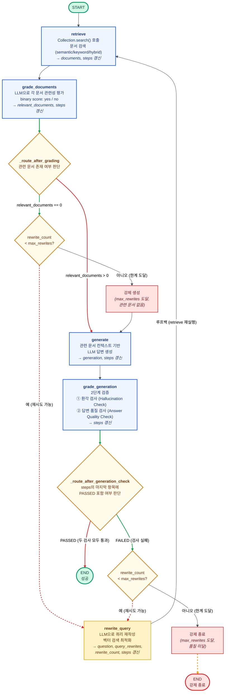
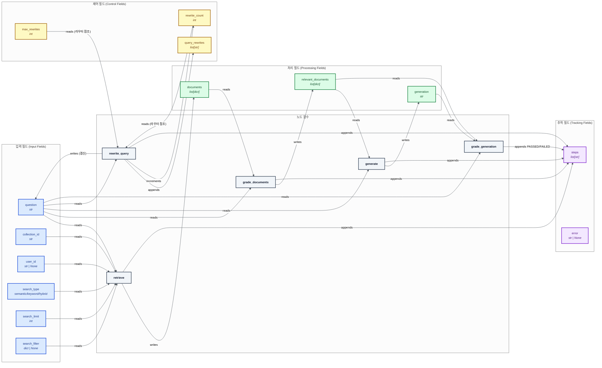

# LangGraph 기반 Agentic RAG 시스템 아키텍처

이 문서는 LangGraph를 활용한 Self-Correcting Retrieval-Augmented Generation(Agentic RAG) 시스템의 아키텍처를 세 가지 관점에서 시각화합니다.

---

## 다이어그램 1: 시스템 전체 아키텍처 개요

전체 시스템의 구성 요소와 파일 간 의존 관계를 보여줍니다. MCP 도구와 REST API라는 두 가지 진입점에서 시작하여 LangGraph StateGraph 엔진, 그리고 PostgreSQL+pgvector 데이터 계층까지의 전체 구조를 나타냅니다.

```mermaid
%%{init: {'theme': 'neutral', 'themeVariables': {'primaryColor': '#f8f9fa', 'primaryBorderColor': '#495057', 'lineColor': '#495057', 'fontSize': '14px'}}}%%
flowchart TD
    subgraph ENTRY["진입점 (Entry Points)"]
        MCP["MCP 도구<br/><b>agentic_search()</b><br/><i>mcpserver/mcp_server.py</i>"]
        REST["REST API<br/><b>POST /collections/{id}/agentic-search</b><br/><i>api/agentic.py</i>"]
    end

    subgraph ENGINE["Agentic RAG 엔진 (agent/)"]
        INIT["<b>run_agentic_search()</b><br/><i>__init__.py</i><br/>메인 진입점 · LLM 초기화 · 그래프 실행"]

        subgraph GRAPH_BUILD["그래프 구성 (graph.py)"]
            GRAPH["<b>build_agentic_rag_graph()</b><br/>StateGraph 빌드 · 노드 등록 · 조건부 엣지"]
            ROUTE1["<b>_route_after_grading()</b><br/>문서 관련성 기반 라우팅"]
            ROUTE2["<b>_route_after_generation_check()</b><br/>생성 품질 기반 라우팅"]
        end

        subgraph NODES["노드 함수 (nodes.py) — 5개"]
            N1["retrieve<br/>문서 검색"]
            N2["grade_documents<br/>문서 관련성 평가"]
            N3["generate<br/>답변 생성"]
            N4["rewrite_query<br/>쿼리 재작성"]
            N5["grade_generation<br/>답변 품질 검증"]
        end

        subgraph GRADERS["평가 모델 (graders.py)"]
            G1["GradeDocumentRelevance<br/><i>Pydantic 모델</i>"]
            G2["GradeHallucination<br/><i>Pydantic 모델</i>"]
            G3["GradeAnswer<br/><i>Pydantic 모델</i>"]
            GF1["get_document_grader()"]
            GF2["get_hallucination_grader()"]
            GF3["get_answer_grader()"]
        end

        subgraph PROMPTS["프롬프트 템플릿 (prompts.py) — 5개"]
            P1["DOCUMENT_GRADER_PROMPT"]
            P2["QUERY_REWRITER_PROMPT"]
            P3["ANSWER_GENERATOR_PROMPT"]
            P4["HALLUCINATION_GRADER_PROMPT"]
            P5["ANSWER_GRADER_PROMPT"]
        end

        subgraph SUPPORT["지원 모듈"]
            STATE["<b>state.py</b><br/>AgentState TypedDict<br/>14개 필드"]
            CONFIG["<b>config.py</b><br/>get_agent_llm()<br/>OpenAI / Google 선택"]
        end
    end

    subgraph DATA["데이터 계층 (Data Layer)"]
        COLL["<b>Collection.search()</b><br/><i>database/collections.py</i><br/>검색 유형: semantic · keyword · hybrid"]
        PG[("PostgreSQL<br/>+ pgvector<br/>벡터 임베딩 저장소")]
    end

    MCP -->|"run_agentic_search() 호출"| INIT
    REST -->|"run_agentic_search() 호출"| INIT
    INIT -->|"build_agentic_rag_graph(llm)"| GRAPH
    INIT -->|"get_agent_llm()"| CONFIG

    GRAPH --> NODES
    GRAPH --> ROUTE1
    GRAPH --> ROUTE2

    N1 -->|"Collection.search() 호출"| COLL
    COLL -->|"SQL + 벡터 검색"| PG

    N2 -->|"get_document_grader()"| GF1
    N5 -->|"get_hallucination_grader()"| GF2
    N5 -->|"get_answer_grader()"| GF3

    GF1 --> G1
    GF2 --> G2
    GF3 --> G3

    GF1 -->|"uses"| P1
    N4 -->|"uses"| P2
    N3 -->|"uses"| P3
    GF2 -->|"uses"| P4
    GF3 -->|"uses"| P5

    NODES -.->|"reads/writes"| STATE

    classDef entryStyle fill:#dbe9ff,stroke:#2563eb,stroke-width:2px,color:#1e3a8a
    classDef engineStyle fill:#f0fdf4,stroke:#16a34a,stroke-width:2px,color:#14532d
    classDef nodeStyle fill:#ffffff,stroke:#4b5563,stroke-width:1.5px,color:#111827
    classDef graderStyle fill:#fefce8,stroke:#ca8a04,stroke-width:1.5px,color:#713f12
    classDef promptStyle fill:#fdf4ff,stroke:#9333ea,stroke-width:1.5px,color:#581c87
    classDef dataStyle fill:#fff7ed,stroke:#ea580c,stroke-width:2px,color:#7c2d12
    classDef supportStyle fill:#f8fafc,stroke:#64748b,stroke-width:1.5px,color:#334155

    class MCP,REST entryStyle
    class INIT engineStyle
    class N1,N2,N3,N4,N5 nodeStyle
    class G1,G2,G3,GF1,GF2,GF3 graderStyle
    class P1,P2,P3,P4,P5 promptStyle
    class COLL,PG dataStyle
    class STATE,CONFIG supportStyle
```



---

## 다이어그램 2: LangGraph 실행 흐름

LangGraph StateGraph의 노드별 실행 순서와 조건부 라우팅 로직을 상세히 보여줍니다. 초록색 경로는 성공/진행 경로, 주황색/빨간색은 재시도/강제 종료 경로를 나타냅니다. `max_rewrites` 루프 가드가 무한 루프를 방지합니다.



---

## 다이어그램 3: AgentState 데이터 흐름

각 노드가 `AgentState`의 어떤 필드를 읽고 쓰는지를 좌→우 방향으로 보여줍니다. AgentState의 14개 필드는 기능별로 입력(Input), 처리(Processing), 제어(Control), 추적(Tracking) 네 그룹으로 분류됩니다.



---

## 파일 구조 참조

```
langconnect_mcp/
├── mcpserver/
│   └── mcp_server.py          # MCP 진입점: agentic_search() 도구
├── langconnect/
│   ├── api/
│   │   └── agentic.py         # REST 진입점: POST /collections/{id}/agentic-search
│   ├── agent/
│   │   ├── __init__.py        # run_agentic_search() — 공통 진입점
│   │   ├── graph.py           # LangGraph StateGraph 구성 + 라우터 함수
│   │   ├── nodes.py           # 5개 노드 함수 (retrieve, grade_documents, generate, rewrite_query, grade_generation)
│   │   ├── graders.py         # 3개 Pydantic 모델 + 3개 팩토리 함수
│   │   ├── prompts.py         # 5개 프롬프트 템플릿
│   │   ├── state.py           # AgentState TypedDict (14개 필드)
│   │   └── config.py          # LLM 프로바이더 선택 (OpenAI / Google)
│   └── database/
│       └── collections.py     # Collection.search() — PostgreSQL + pgvector
```
