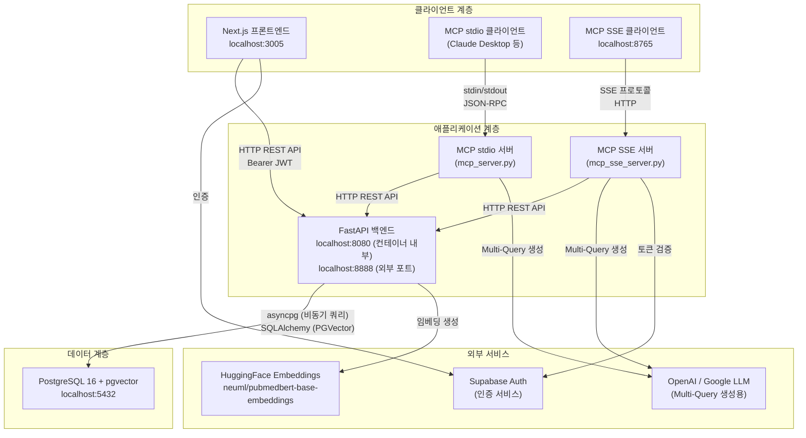
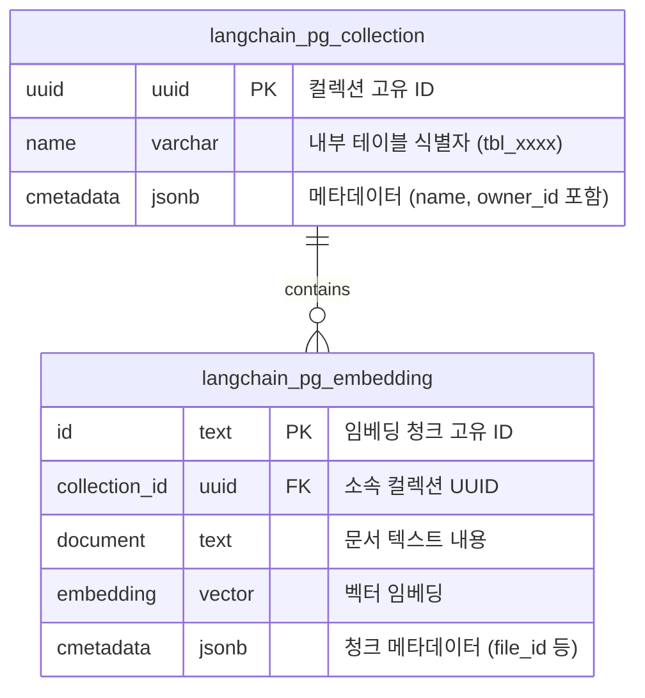
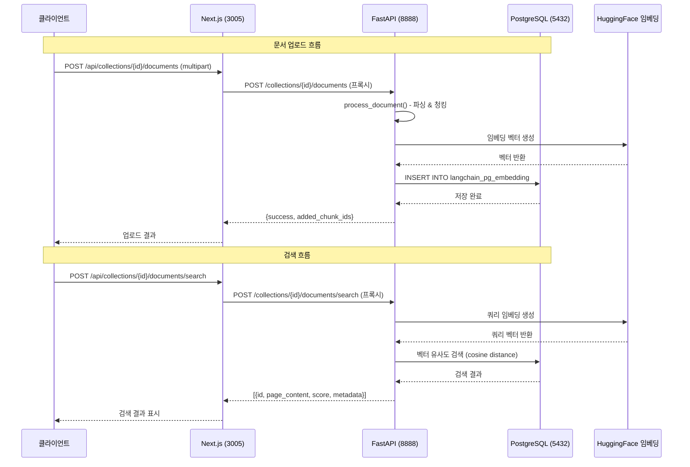
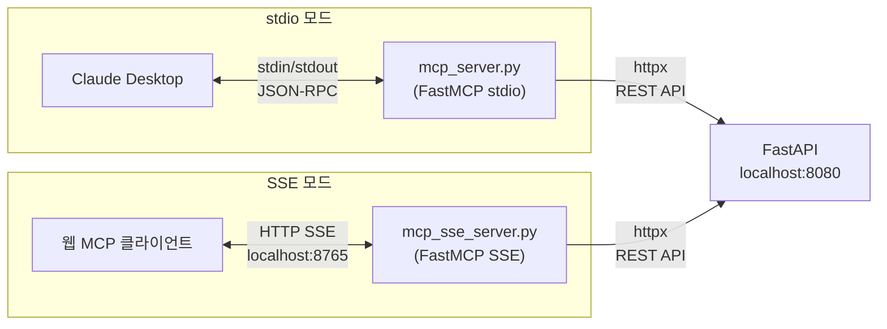
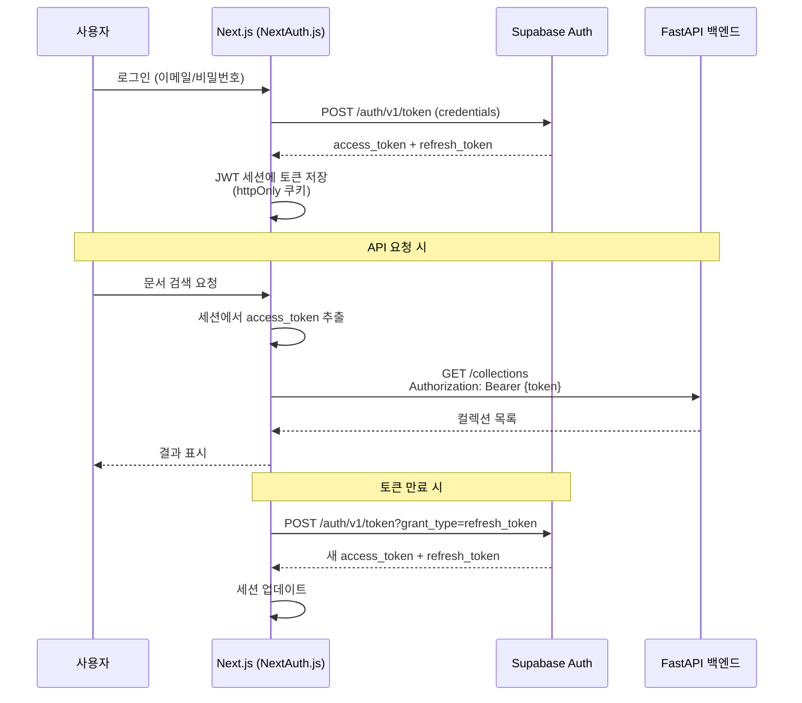
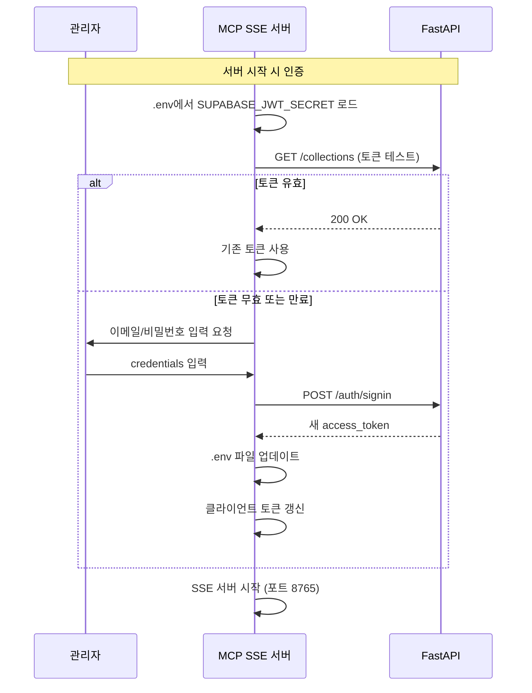
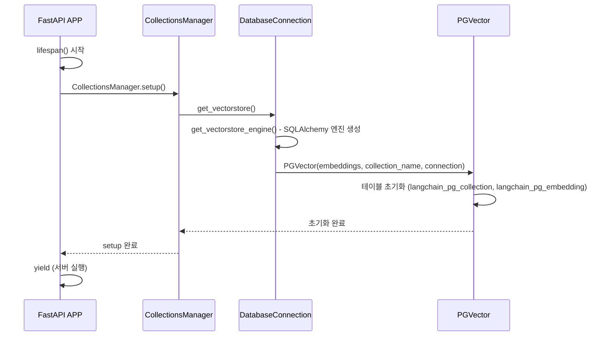

# LangConnect RAG 시스템 전체 아키텍처 개요

## 1. 시스템 구성 개요

LangConnect는 PostgreSQL+pgvector 기반의 3-Tier RAG(Retrieval-Augmented Generation) 시스템이다. 사용자는 Next.js 프론트엔드 또는 MCP(Model Context Protocol) 클라이언트를 통해 문서를 관리하고 벡터 검색을 수행할 수 있다.

### 1.1 전체 시스템 구성도



### 1.2 기술 스택 요약

| 계층 | 기술 | 버전/상세 |
|------|------|-----------|
| 프론트엔드 | Next.js, React, TypeScript, Tailwind CSS | Next.js 15.3.4, React 19 |
| 백엔드 API | FastAPI, LangChain, Python | Python 3.11+ |
| 데이터베이스 | PostgreSQL + pgvector | PostgreSQL 16 (`pgvector/pgvector:pg16` 이미지) |
| 임베딩 | HuggingFace `neuml/pubmedbert-base-embeddings` | CPU 기반, 정규화 활성화 |
| MCP 프레임워크 | FastMCP | stdio 및 SSE(streamable-http) 전송 지원 |
| 인증 | Supabase Auth + NextAuth.js | JWT 기반 |
| 컨테이너 | Docker Compose | 3개 서비스: postgres, api, nextjs |

> **참조**: 임베딩 모델 설정은 `langconnect/config.py` 라인 11-26에서 확인 가능하다. 현재 `neuml/pubmedbert-base-embeddings` 모델을 사용하며, CPU에서 실행되고 정규화가 활성화되어 있다.

---

## 2. 컴포넌트 간 관계도

### 2.1 백엔드 모듈 구조

```mermaid
classDiagram
    class FastAPI_APP {
        +health_check()
        +lifespan()
    }

    class collections_router {
        +POST /collections
        +GET /collections
        +GET /collections/{id}
        +DELETE /collections/{id}
        +PATCH /collections/{id}
    }

    class documents_router {
        +POST /collections/{id}/documents
        +GET /collections/{id}/documents
        +DELETE /collections/{id}/documents/{doc_id}
        +DELETE /collections/{id}/documents (bulk)
        +POST /collections/{id}/documents/search
    }

    class CollectionsManager {
        -user_id: str
        +setup()
        +list()
        +get(collection_id)
        +create(name, metadata)
        +update(collection_id, name, metadata)
        +delete(collection_id)
    }

    class Collection {
        -collection_id: str
        -user_id: str
        +upsert(documents)
        +delete(file_id, document_id)
        +delete_many(document_ids, file_ids)
        +list(limit, offset)
        +get(document_id)
        +search(query, limit, search_type, filter)
    }

    class DocumentProcessor {
        +process_document(file, metadata, chunk_size, chunk_overlap)
    }

    class PyMuPDF4LLMParser {
        +lazy_parse(blob)
    }

    class PGVector {
        +add_documents()
        +similarity_search_with_score()
    }

    class DatabaseConnection {
        +get_db_pool()
        +get_db_connection()
        +get_vectorstore()
        +get_vectorstore_engine()
    }

    FastAPI_APP --> collections_router
    FastAPI_APP --> documents_router
    collections_router --> CollectionsManager
    documents_router --> Collection
    documents_router --> DocumentProcessor
    CollectionsManager --> DatabaseConnection
    Collection --> DatabaseConnection
    Collection --> PGVector
    DocumentProcessor --> PyMuPDF4LLMParser
    DatabaseConnection --> PGVector
```

> **참조**: 라우터 등록은 `langconnect/server.py` 라인 50-51에서 수행된다.

### 2.2 데이터베이스 테이블 구조

LangChain PGVector가 관리하는 두 개의 핵심 테이블이 존재한다:



**주요 특이사항**:
- `langchain_pg_collection.name` 필드는 사용자에게 보여지는 이름이 아닌 내부 테이블 식별자(`tbl_{uuid.hex}` 형식)로 사용된다 (`langconnect/database/collections.py` 라인 165).
- 사용자에게 보여지는 컬렉션 이름은 `cmetadata` JSONB의 `name` 키에 저장된다 (`langconnect/database/collections.py` 라인 161).
- `owner_id`도 `cmetadata` JSONB 내에 저장되어 사용자별 컬렉션 격리를 구현한다 (`langconnect/database/collections.py` 라인 160).
- pgvector 확장은 초기화 스크립트(`init-scripts/01-init-extensions.sql`)에서 `CREATE EXTENSION IF NOT EXISTS vector;`로 활성화된다.

---

## 3. 서비스 간 통신 방식

### 3.1 Docker Compose 네트워크 구성

세 서비스(postgres, api, nextjs)는 `langconnect-network` 브릿지 네트워크를 통해 통신한다.

| 서비스 | 내부 포트 | 외부 포트 | 역할 |
|--------|-----------|-----------|------|
| `postgres` | 5432 | 5432 | PostgreSQL + pgvector 데이터베이스 |
| `api` | 8080 | 8888 | FastAPI REST API 서버 |
| `nextjs` | 3000 | 3005 | Next.js 프론트엔드 |

> **참조**: `docker-compose.yml` 라인 39, 65, 73에서 포트 매핑을 확인할 수 있다.

### 3.2 통신 프로토콜



### 3.3 MCP 통신 구조

MCP 서버는 두 가지 전송 방식을 지원한다:



**MCP 서버 구현 비교**:

| 항목 | stdio 서버 (`mcp_server.py`) | SSE 서버 (`mcp_sse_server.py`) |
|------|------------------------------|-------------------------------|
| 전송 방식 | stdin/stdout | HTTP SSE (포트 8765) |
| 인증 | 환경변수 `SUPABASE_JWT_SECRET` 직접 사용 | 시작 시 Supabase 로그인으로 토큰 획득 |
| 도구 수 | 11개 (add_documents_from_files 포함) | 9개 |
| 리소스 | `resource://how-to-use-langconnect-rag-mcp` | 없음 |
| 프롬프트 | `rag-prompt` | 없음 |
| 베이스 클래스 | 독립 (FastMCP 직접 사용) | 독립 (FastMCP 직접 사용) |
| Multi-Query LLM | `gpt-5-nano` (OpenAI) | `gpt-5-nano` (OpenAI) |

> **참조**: `base_mcp_server.py`는 별도의 베이스 클래스(`BaseMCPServer`)를 정의하지만, 현재 stdio/SSE 서버는 이를 상속하지 않고 독립적으로 FastMCP를 사용한다. `BaseMCPServer`는 미들웨어(ErrorHandling, Timing, Logging, RateLimiting)를 포함하는 고급 구현이다.

### 3.4 MCP 도구 목록

stdio 서버(`mcp_server.py`)에서 등록된 도구들:

| 도구명 | 설명 | 주요 매개변수 |
|--------|------|---------------|
| `search_documents` | 문서 검색 (semantic/keyword/hybrid) | `collection_id`, `query`, `limit`, `search_type`, `filter_json` |
| `list_collections` | 전체 컬렉션 목록 조회 | 없음 |
| `get_collection` | 특정 컬렉션 상세 조회 | `collection_id` |
| `create_collection` | 새 컬렉션 생성 | `name`, `metadata_json` |
| `delete_collection` | 컬렉션 삭제 | `collection_id` |
| `list_documents` | 컬렉션 내 문서 목록 | `collection_id`, `limit` |
| `add_documents` | 텍스트 문서 추가 | `collection_id`, `text`, `chunk_size`, `chunk_overlap` |
| `add_documents_from_files` | 파일 시스템에서 직접 업로드 | `collection_id`, `file_paths`, `chunk_size`, `chunk_overlap` |
| `delete_document` | 문서 삭제 | `collection_id`, `document_id` |
| `get_health_status` | API 헬스 체크 | 없음 |
| `multi_query` | Multi-Query 생성 (LLM 활용) | `question` |

> **참조**: MCP 도구 등록은 `mcpserver/mcp_server.py`에서 `@mcp.tool` 데코레이터로 수행된다.

---

## 4. 인증 흐름

### 4.1 웹 UI 인증 흐름



### 4.2 MCP SSE 서버 인증 흐름



> **참조**: SSE 서버의 인증 로직은 `mcpserver/mcp_sse_server.py`의 `ensure_valid_token()` 함수(라인 152-175)에서 구현된다. 토큰은 약 1시간 후 만료되며, 만료 시 서버 재시작이 필요하다(라인 415).

### 4.3 사용자별 데이터 격리

- FastAPI 백엔드는 `user_id`를 통해 컬렉션과 문서에 대한 접근을 제어한다.
- `CollectionsManager(user_id)`와 `Collection(collection_id, user_id)`에서 `user_id`가 `None`이 아닌 경우, 모든 SQL 쿼리에 `AND cmetadata->>'owner_id' = $N` 조건이 추가된다.
- 현재 API 라우터(`langconnect/api/collections.py`, `langconnect/api/documents.py`)에서는 `user_id=None`으로 호출하여 인증 없이 모든 데이터에 접근 가능한 상태이다.

> **참조**: `langconnect/api/collections.py` 라인 19에서 `CollectionsManager(None)`으로 호출되며, `langconnect/api/documents.py` 라인 135에서 `Collection(collection_id=str(collection_id), user_id=None)`으로 호출된다.

---

## 5. CORS 설정

FastAPI 서버는 CORS 미들웨어를 통해 교차 출처 요청을 허용한다.

- **기본값**: `http://localhost:3000` (환경변수 미설정 시)
- **Docker 환경**: `["http://localhost:3005", "http://localhost:8888", "http://localhost", "http://127.0.0.1:3005", "http://127.0.0.1:8888", "http://127.0.0.1"]`
- **설정 위치**: `langconnect/config.py` 라인 41-48, `langconnect/server.py` 라인 41-47

```python
# langconnect/server.py (라인 41-47)
APP.add_middleware(
    CORSMiddleware,
    allow_origins=ALLOWED_ORIGINS,
    allow_credentials=True,
    allow_methods=["*"],
    allow_headers=["*"],
)
```

---

## 6. 애플리케이션 라이프사이클

### 6.1 서버 시작



> **참조**: 라이프사이클 관리는 `langconnect/server.py` 라인 24-30의 `lifespan()` 함수에서 수행된다. `CollectionsManager.setup()`은 `get_vectorstore()`를 호출하여 PGVector 인스턴스를 생성하고, 이 과정에서 필요한 테이블이 자동으로 생성된다.

### 6.2 데이터베이스 연결 관리

두 가지 연결 방식이 공존한다:

1. **asyncpg 풀**: 직접 SQL 쿼리용 (컬렉션 목록, 키워드 검색, 문서 삭제 등)
   - `get_db_pool()` -> 전역 `_pool` 싱글턴
   - `get_db_connection()` -> 풀에서 연결 획득/반환

2. **SQLAlchemy 엔진**: LangChain PGVector 연산용 (임베딩 저장, 시맨틱 검색)
   - `get_vectorstore_engine()` -> `postgresql+psycopg://` 연결 문자열
   - `get_vectorstore()` -> `PGVector` 인스턴스 반환

> **참조**: 연결 관리는 `langconnect/database/connection.py`에서 구현된다. asyncpg 풀은 라인 21-34, SQLAlchemy 엔진은 라인 53-63에서 정의된다.
