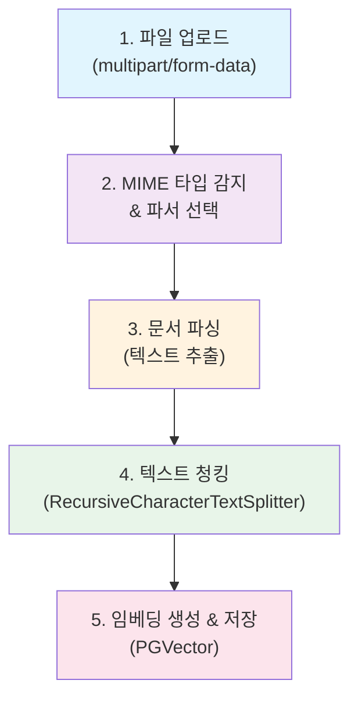
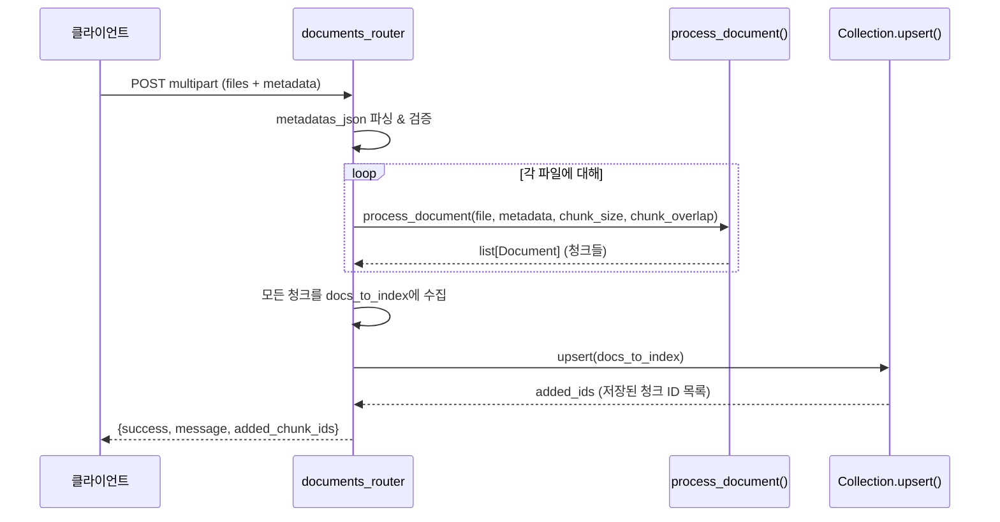
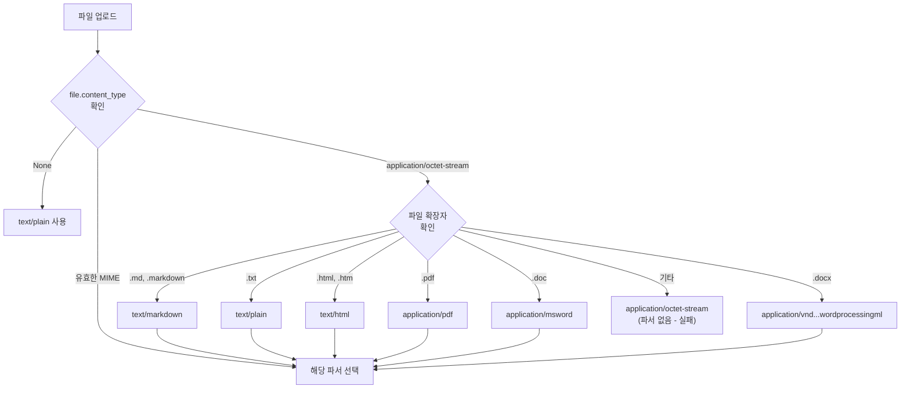
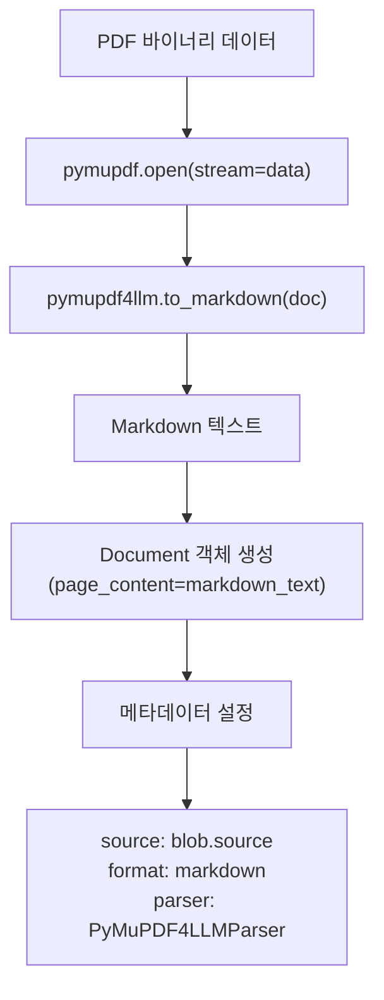
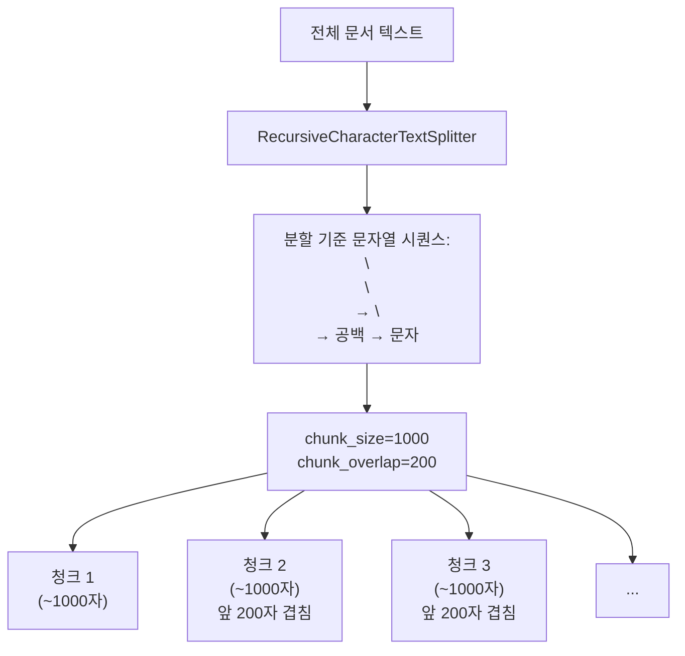
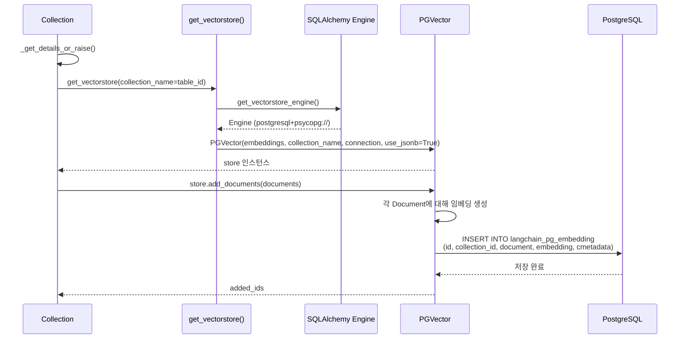
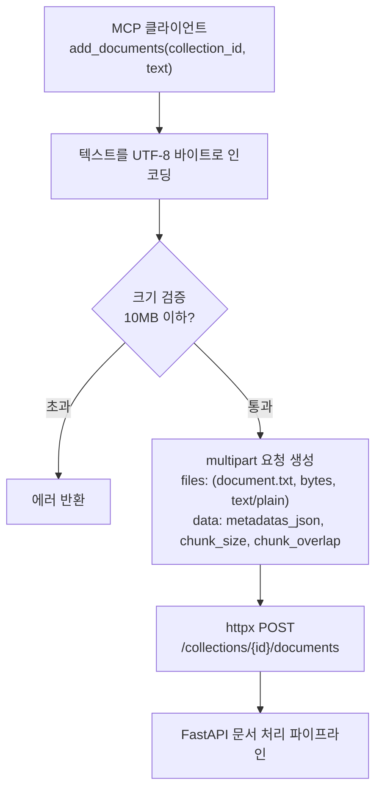
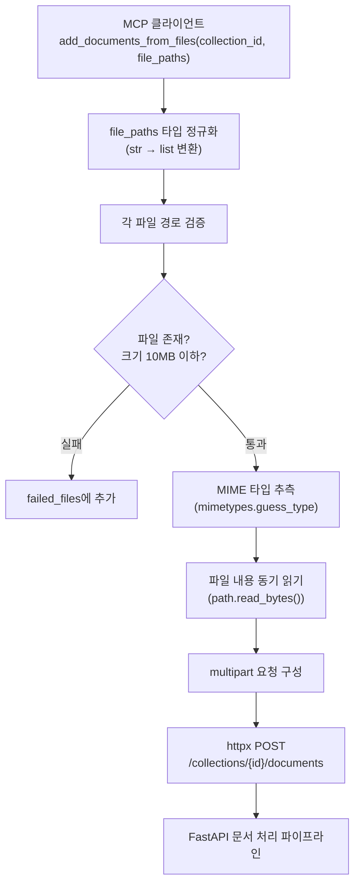
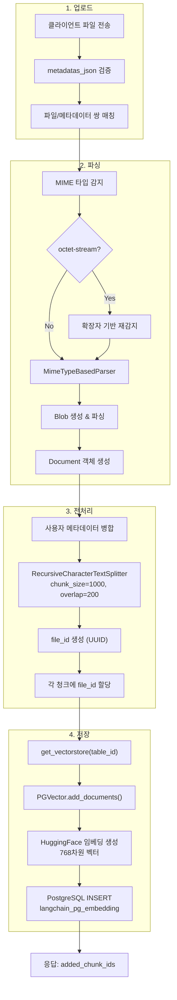

# 문서 처리 파이프라인 분석

## 1. 전체 흐름 개요

LangConnect의 문서 처리 파이프라인은 파일 업로드부터 벡터 저장까지 5단계로 구성된다.



---

## 2. 단계별 상세 분석

### 2.1 파일 업로드 (단계 1)

#### API 엔드포인트

```
POST /collections/{collection_id}/documents
Content-Type: multipart/form-data
```

#### 요청 매개변수

| 매개변수 | 타입 | 기본값 | 설명 |
|----------|------|--------|------|
| `files` | `list[UploadFile]` | 필수 | 업로드할 파일 목록 |
| `metadatas_json` | `str \| None` | `None` | 각 파일의 메타데이터 (JSON 문자열) |
| `chunk_size` | `int` | `1000` | 청크 최대 문자 수 |
| `chunk_overlap` | `int` | `200` | 청크 간 겹치는 문자 수 |

> **참조**: `langconnect/api/documents.py` 라인 54-60

#### 업로드 흐름



#### 메타데이터 검증

메타데이터는 `TypeAdapter(list[dict[str, Any]])`를 통해 검증된다. 파일 수와 메타데이터 객체 수가 일치해야 한다.

```python
# langconnect/api/documents.py (라인 17-18)
_metadata_adapter = TypeAdapter(list[dict[str, Any]])

# 라인 78
metadatas = _metadata_adapter.validate_json(metadatas_json)
```

#### 에러 처리

- 개별 파일 처리 실패 시 해당 파일을 `failed_files`에 기록하고 나머지 파일은 계속 처리한다 (라인 117-120).
- 모든 파일 처리 실패 시 400 에러를 반환한다 (라인 125-129).
- 일부 파일만 성공한 경우 성공 응답에 `warnings` 필드를 포함한다 (라인 157-160).

> **참조**: `langconnect/api/documents.py` 라인 92-163

---

### 2.2 MIME 타입 감지 및 파서 선택 (단계 2)

#### 지원 파일 형식

| MIME 타입 | 파일 확장자 | 파서 | 출력 형식 |
|-----------|-------------|------|-----------|
| `application/pdf` | `.pdf` | `PyMuPDF4LLMParser` | Markdown |
| `text/plain` | `.txt` | `TextParser` | 원본 텍스트 |
| `text/html` | `.html`, `.htm` | `BS4HTMLParser` | 파싱된 텍스트 |
| `text/markdown` | `.md` | `TextParser` | 원본 텍스트 |
| `text/x-markdown` | `.markdown` | `TextParser` | 원본 텍스트 |
| `application/msword` | `.doc` | `MsWordParser` | 추출된 텍스트 |
| `application/vnd.openxmlformats-officedocument.wordprocessingml.document` | `.docx` | `MsWordParser` | 추출된 텍스트 |

> **참조**: `langconnect/services/document_processor.py` 라인 18-28

#### MIME 타입 감지 로직



`application/octet-stream`인 경우 파일 확장자를 기반으로 올바른 MIME 타입을 재감지한다.

> **참조**: `langconnect/services/document_processor.py` 라인 55-71

#### MimeTypeBasedParser

```python
# langconnect/services/document_processor.py (라인 32-35)
MIMETYPE_BASED_PARSER = MimeTypeBasedParser(
    handlers=HANDLERS,
    fallback_parser=None,  # fallback 없음 - 미지원 형식은 실패
)
```

`fallback_parser=None`으로 설정되어 있어 지원하지 않는 MIME 타입의 파일은 파싱에 실패한다.

---

### 2.3 문서 파싱 (단계 3)

#### PDF 파싱 - PyMuPDF4LLMParser

PDF 파일은 `pymupdf4llm` 라이브러리를 사용하여 Markdown 형식으로 변환된다.



**핵심 특성**:
- PDF 전체를 하나의 Document 객체로 변환한다 (페이지별 분리가 아님).
- 헤더, 리스트, 테이블 등의 서식이 Markdown으로 보존된다.
- 에러 발생 시 빈 내용의 Document를 반환하며, 메타데이터에 에러 정보를 포함한다.

> **참조**: `langconnect/parsers/pymupdf_parser.py` 라인 38-92

```python
# langconnect/parsers/pymupdf_parser.py (라인 56-59)
doc = pymupdf.open(stream=pdf_data, filetype="pdf")
markdown_text = pymupdf4llm.to_markdown(doc, **self.kwargs)
doc.close()
```

#### 기타 파서

| 파서 | 라이브러리 | 동작 방식 |
|------|-----------|-----------|
| `TextParser` | `langchain_community` | 텍스트를 그대로 Document에 저장 |
| `BS4HTMLParser` | `langchain_community` (BeautifulSoup4) | HTML 파싱 후 텍스트 추출 |
| `MsWordParser` | `langchain_community` | DOC/DOCX에서 텍스트 추출 |

#### 파싱 결과에 메타데이터 추가

사용자가 제공한 메타데이터가 있으면 파싱된 Document 객체에 병합된다:

```python
# langconnect/services/document_processor.py (라인 84-91)
if metadata:
    for doc in docs:
        if not hasattr(doc, "metadata") or not isinstance(doc.metadata, dict):
            doc.metadata = {}
        doc.metadata.update(metadata)  # 기존 키는 보존, 사용자 키 추가
```

---

### 2.4 텍스트 청킹 (단계 4)

#### RecursiveCharacterTextSplitter

LangChain의 `RecursiveCharacterTextSplitter`를 사용하여 문서를 청크로 분할한다.



#### 청킹 매개변수

| 매개변수 | 기본값 | 설명 |
|----------|--------|------|
| `chunk_size` | 1000 | 각 청크의 최대 문자 수 |
| `chunk_overlap` | 200 | 인접 청크 간 겹치는 문자 수 |

> **참조**: `langconnect/services/document_processor.py` 라인 94-96

```python
# langconnect/services/document_processor.py (라인 94-96)
text_splitter = RecursiveCharacterTextSplitter(
    chunk_size=chunk_size, chunk_overlap=chunk_overlap
)
```

#### RecursiveCharacterTextSplitter 분할 전략

이 스플리터는 계층적으로 분할 기준을 적용한다:

1. **`\n\n`** (단락 구분) 우선 시도
2. **`\n`** (줄 바꿈) 시도
3. **` `** (공백) 시도
4. **문자 단위** (최후 수단)

`chunk_size`를 초과하지 않는 범위에서 가장 큰 의미 단위로 분할을 시도한다. `chunk_overlap`은 인접 청크 사이의 문맥 연속성을 유지하기 위해 사용된다.

#### 청킹 결과 로깅

```python
# langconnect/services/document_processor.py (라인 100-108)
LOGGER.info(f"Created {len(split_docs)} chunks after splitting")

if split_docs:
    chunk_sizes = [len(doc.page_content) for doc in split_docs]
    LOGGER.info(
        f"Chunk size stats - min: {min(chunk_sizes)}, max: {max(chunk_sizes)}, "
        f"avg: {sum(chunk_sizes) / len(chunk_sizes):.0f}"
    )
```

#### file_id 할당

청킹 후 각 청크에 고유한 `file_id`가 메타데이터로 추가된다. 이 `file_id`는 파일 단위 삭제에 사용된다.

```python
# langconnect/services/document_processor.py (라인 46, 111-118)
file_id = uuid.uuid4()  # 파일 처리 시작 시 생성

for split_doc in split_docs:
    split_doc.metadata["file_id"] = str(file_id)
```

**중요**: `file_id`는 업로드된 파일 단위로 생성되며, 같은 파일에서 나온 모든 청크는 동일한 `file_id`를 공유한다. 이를 통해 특정 파일의 모든 청크를 한 번에 삭제할 수 있다.

---

### 2.5 임베딩 생성 및 저장 (단계 5)

#### 임베딩 모델 설정

```python
# langconnect/config.py (라인 17-26)
from langchain_huggingface import HuggingFaceEmbeddings

model_name = "neuml/pubmedbert-base-embeddings"
model_kwargs = {'device': 'cpu'}
encode_kwargs = {'normalize_embeddings': True}

DEFAULT_EMBEDDINGS = HuggingFaceEmbeddings(
    model_name=model_name,
    model_kwargs=model_kwargs,
    encode_kwargs=encode_kwargs
)
```

| 설정 항목 | 값 | 설명 |
|-----------|-----|------|
| 모델 | `neuml/pubmedbert-base-embeddings` | PubMedBERT 기반 임베딩 |
| 벡터 차원 | 768 | PubMedBERT 기본 차원 |
| 디바이스 | `cpu` | CPU에서 실행 |
| 정규화 | `True` | L2 정규화 활성화 (코사인 유사도에 최적화) |

> **참고**: 코드에는 주석 처리된 OpenAI `text-embedding-3-small` 모델 설정이 있다 (`config.py` 라인 13-15). 현재는 HuggingFace 모델이 사용 중이다.

#### PGVector를 통한 저장



#### PGVector 설정

```python
# langconnect/database/connection.py (라인 81-87)
store = PGVector(
    embeddings=embeddings,              # HuggingFace 임베딩 인스턴스
    collection_name=collection_name,     # 내부 테이블 ID (tbl_xxxx)
    connection=engine,                   # SQLAlchemy 엔진
    use_jsonb=True,                      # 메타데이터를 JSONB로 저장
    collection_metadata=collection_metadata,  # 컬렉션 메타데이터
)
```

#### 저장 데이터 구조

`langchain_pg_embedding` 테이블에 저장되는 각 행:

| 컬럼 | 타입 | 내용 |
|------|------|------|
| `id` | `text` | 청크 고유 ID (UUID) |
| `collection_id` | `uuid` | 소속 컬렉션 UUID |
| `document` | `text` | 청크 텍스트 내용 |
| `embedding` | `vector` | 768차원 벡터 (PubMedBERT) |
| `cmetadata` | `jsonb` | `{file_id, source, ...}` |

---

## 3. MCP를 통한 문서 추가

### 3.1 텍스트 직접 추가 (add_documents)



> **참조**: `mcpserver/mcp_server.py` 라인 377-454

### 3.2 파일 시스템에서 직접 업로드 (add_documents_from_files)



**add_documents_from_files 특이사항**:

1. `file_paths` 매개변수는 `list[str]` 또는 `str`을 모두 허용한다. 문자열인 경우 JSON 배열로 파싱을 시도하고, 실패하면 단일 경로로 처리한다 (`mcp_server.py` 라인 504-519).
2. 파일 읽기는 동기 방식(`path.read_bytes()`)으로 수행한다. 10MB 이하 파일이므로 성능 문제가 없으며, MCP stdio 컨텍스트에서 스레드 풀 관련 문제를 회피한다 (`mcp_server.py` 라인 571).
3. 각 파일에 자동으로 메타데이터가 추가된다: `source`, `created_at`, `filename`, `file_path`, `mime_type` (`mcp_server.py` 라인 576-583).

> **참조**: `mcpserver/mcp_server.py` 라인 457-649

---

## 4. 전체 파이프라인 상세 흐름도



---

## 5. 컬렉션 생성 시 테이블 관리

컬렉션 생성 시 내부적으로 PGVector 테이블 식별자가 자동 생성된다:

```python
# langconnect/database/collections.py (라인 164-168)
table_id = f"tbl_{uuid.uuid4().hex}"  # 예: "tbl_a1b2c3d4e5f6..."

# PGVector 인스턴스 생성 시 해당 테이블이 자동으로 생성됨
get_vectorstore(table_id, collection_metadata=metadata)
```

`langchain_pg_collection` 테이블의 `name` 컬럼에 이 `table_id`가 저장되며, 사용자에게 보여지는 컬렉션 이름은 `cmetadata` JSONB의 `name` 키에 저장된다. 이 방식은 SQL 네이밍 규칙 호환성을 보장하면서도 사용자 친화적인 이름을 유지한다.
