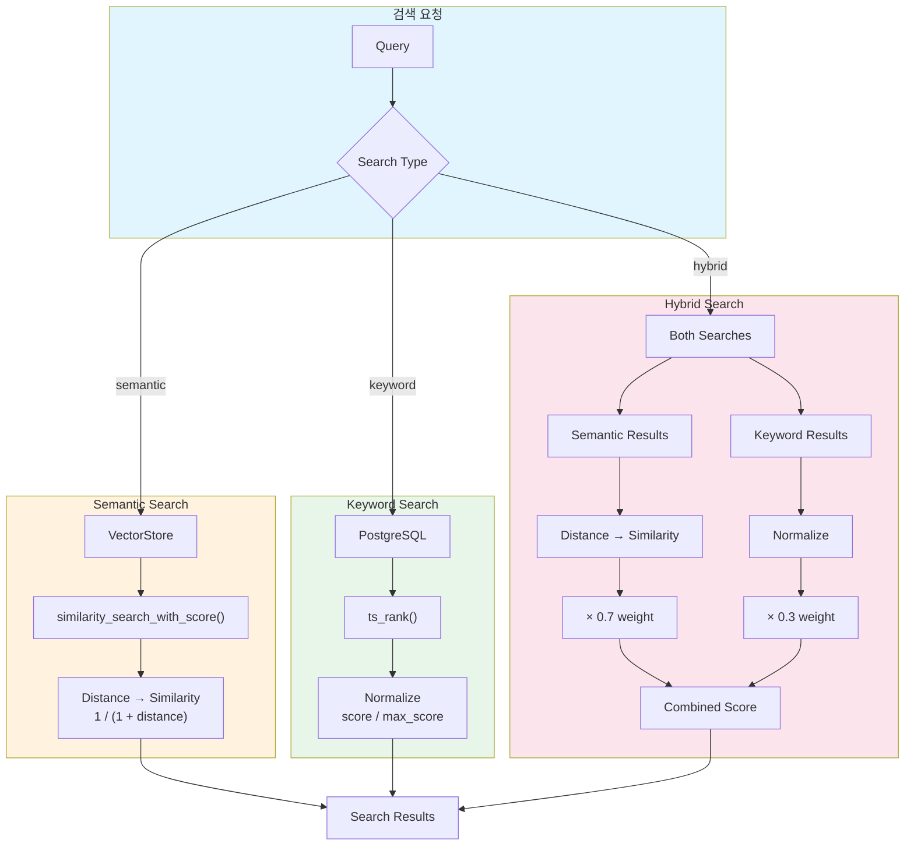
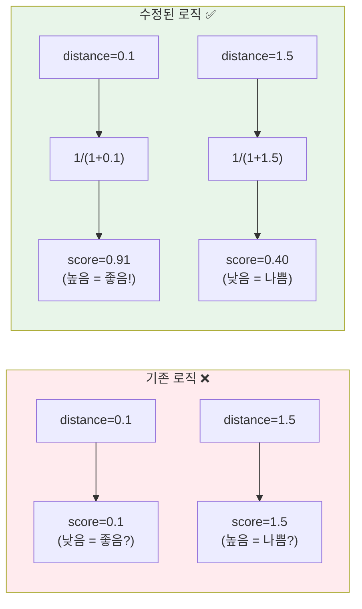
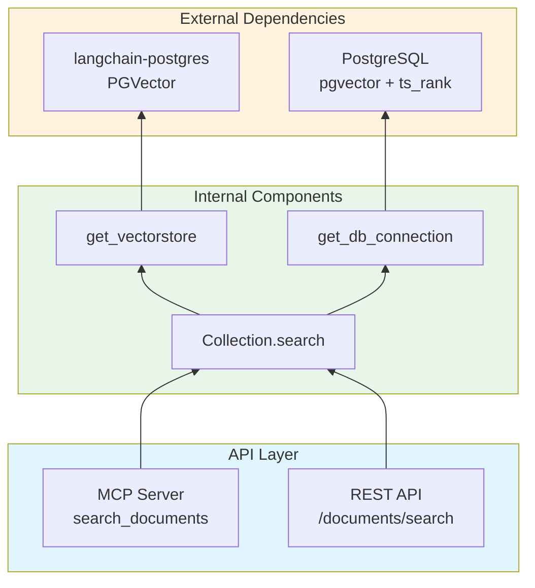

# Hybrid Search Score 수정 구현 문서

> Date: 2025-01-31
> Session: LangChain similarity_search_with_score의 distance 반환값을 similarity로 변환

---

## 1. Overview

### 1.1 Purpose

LangChain의 `similarity_search_with_score` 메서드가 반환하는 **Distance**(거리) 값을 **Similarity**(유사도) 값으로 올바르게 변환하여, 검색 결과의 score가 직관적으로 해석되도록 수정.

### 1.2 Problem vs Solution

| 구분 | Before | After |
|------|--------|-------|
| 반환값 해석 | Distance (낮을수록 유사) | Similarity (높을수록 유사) |
| Score 범위 | [0, ∞) | (0, 1] |
| 사용자 경험 | 혼란스러움 | 직관적 |

---

## 2. Architecture

### 2.1 Search Flow Diagram



### 2.2 Score Transformation



---

## 3. Modified Files

| File | Change Type | Description |
|------|-------------|-------------|
| `langconnect/database/collections.py` | Modified | Semantic/Hybrid search score 변환 로직 수정 |
| `docs/hybrid-search-score-fix.md` | New | 수정 내용 상세 문서화 |

---

## 4. Implementation Details

### 4.1 Key Changes

#### Semantic Search (lines 696-706)

```python
# Before
formatted_results = [
    {"score": score, ...}  # distance 그대로 반환
    for doc, score in results
]

# After
formatted_results = [
    {"score": 1 / (1 + distance), ...}  # similarity로 변환
    for doc, distance in results
]
```

#### Hybrid Search (lines 829-841)

```python
# Before
max_semantic_score = max((score for _, score in semantic_results), default=1.0)
normalized_score = score / max_semantic_score  # 잘못된 정규화

# After
for doc, distance in semantic_results:
    similarity_score = 1 / (1 + distance)  # 올바른 변환
    combined_score = similarity_score * 0.7
```

### 4.2 Conversion Formula

```
similarity = 1 / (1 + distance)
```

| Distance | Similarity | Interpretation |
|----------|------------|----------------|
| 0.0 | 1.0000 | Perfect match |
| 0.1 | 0.9091 | Very similar |
| 0.5 | 0.6667 | Moderately similar |
| 1.0 | 0.5000 | Somewhat dissimilar |
| 2.0 | 0.3333 | Dissimilar |

### 4.3 Why This Formula?

- **항상 (0, 1] 범위**: 음수가 될 수 없음
- **단조 감소**: distance 증가 → similarity 감소
- **직관적**: distance=0 → similarity=1 (완벽한 매칭)

---

## 5. Dependencies



---

## 6. Usage Examples

### Search with Corrected Scores

```python
from langconnect.database.collections import Collection

# Semantic search
results = await Collection(collection_id, user_id).search(
    query="machine learning",
    search_type="semantic",
    limit=5
)

# Results now have intuitive scores
for r in results:
    print(f"{r['score']:.4f}: {r['page_content'][:50]}...")
    # 0.9234: Machine learning is a subset of artificial...
    # 0.8567: Deep learning algorithms can process...
    # 0.7123: Neural networks are fundamental to...
```

### Hybrid Search

```python
results = await Collection(collection_id, user_id).search(
    query="python data analysis",
    search_type="hybrid",
    limit=5
)

# Combined score = semantic * 0.7 + keyword * 0.3
# Both components now in [0, 1] range
```

### MCP Tool Usage

```python
# Via MCP server
result = await search_documents(
    collection_id="uuid-here",
    query="spatial transcriptomics",
    search_type="hybrid",
    limit=10
)
```

---

## 7. Verification

### Test Commands

```bash
# Logic verification (Python)
uv run python -c "
for d in [0, 0.1, 0.5, 1.0, 2.0]:
    s = 1 / (1 + d)
    print(f'distance={d:.1f} → similarity={s:.4f}')
"
```

### Expected Output

```
distance=0.0 → similarity=1.0000
distance=0.1 → similarity=0.9091
distance=0.5 → similarity=0.6667
distance=1.0 → similarity=0.5000
distance=2.0 → similarity=0.3333
```

---

## 8. Breaking Changes

⚠️ **기존 검색 결과의 score 값이 변경됩니다**

- 이전: Distance 값 (낮을수록 유사)
- 이후: Similarity 값 (높을수록 유사)

클라이언트에서 score 기반 필터링/정렬 로직이 있다면 수정 필요.

---

## 9. References

- [LangChain Issue #13437](https://github.com/langchain-ai/langchain/issues/13437): Distance vs Similarity
- [langchain-postgres #234](https://github.com/langchain-ai/langchain-postgres/issues/234): Hybrid search scoring
- 상세 문서: `docs/hybrid-search-score-fix.md`
