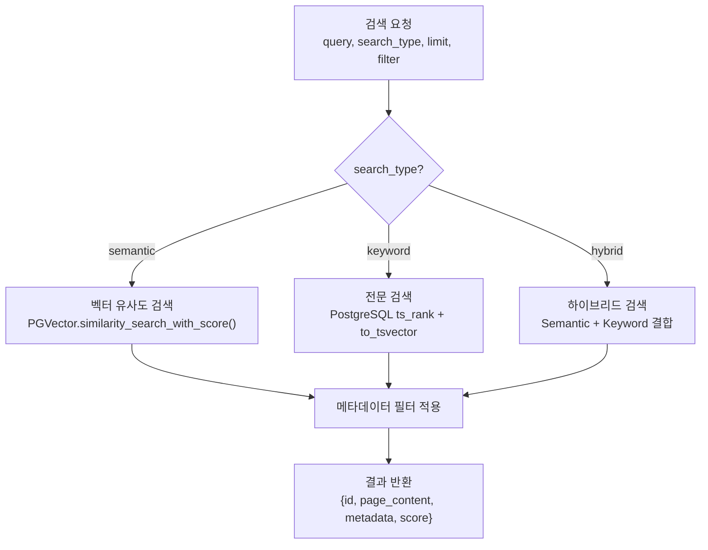
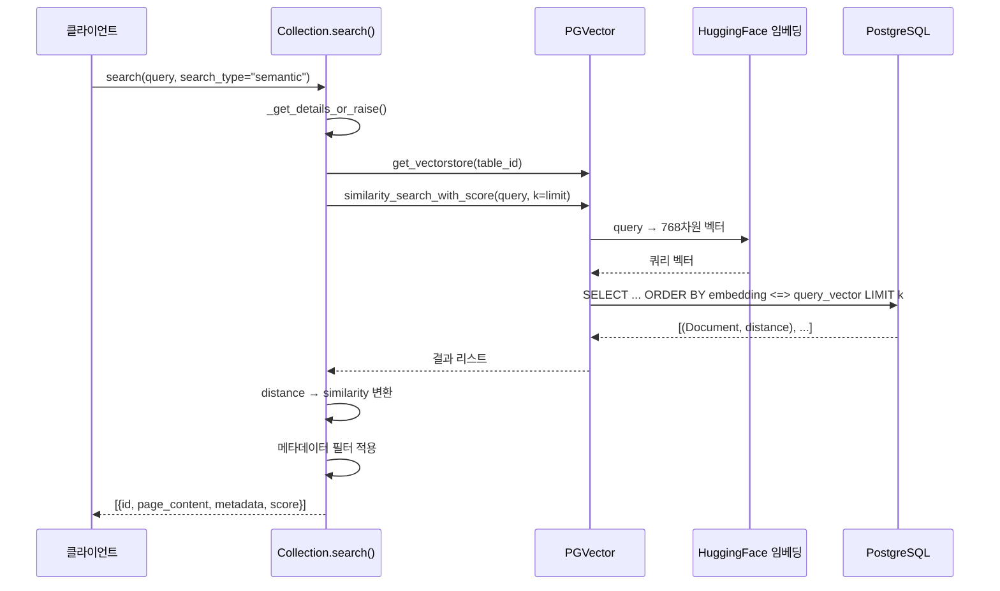
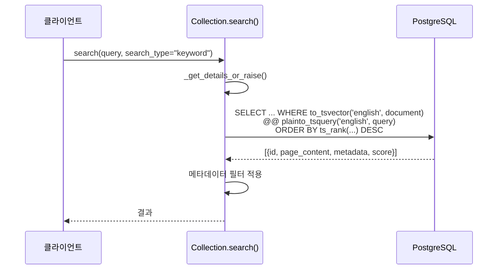
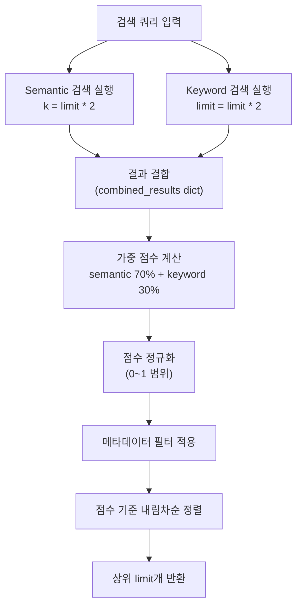
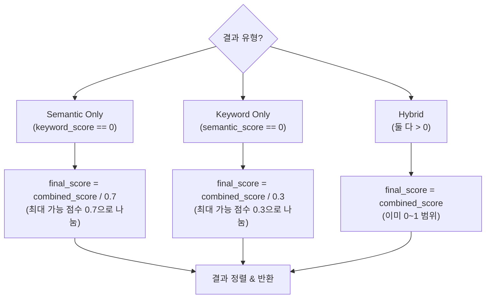
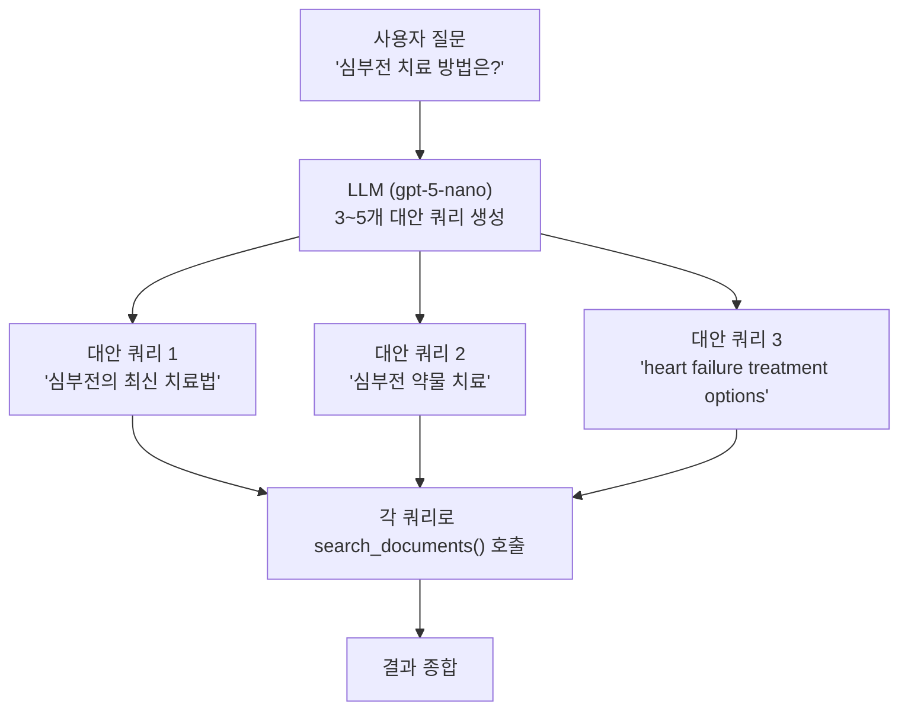
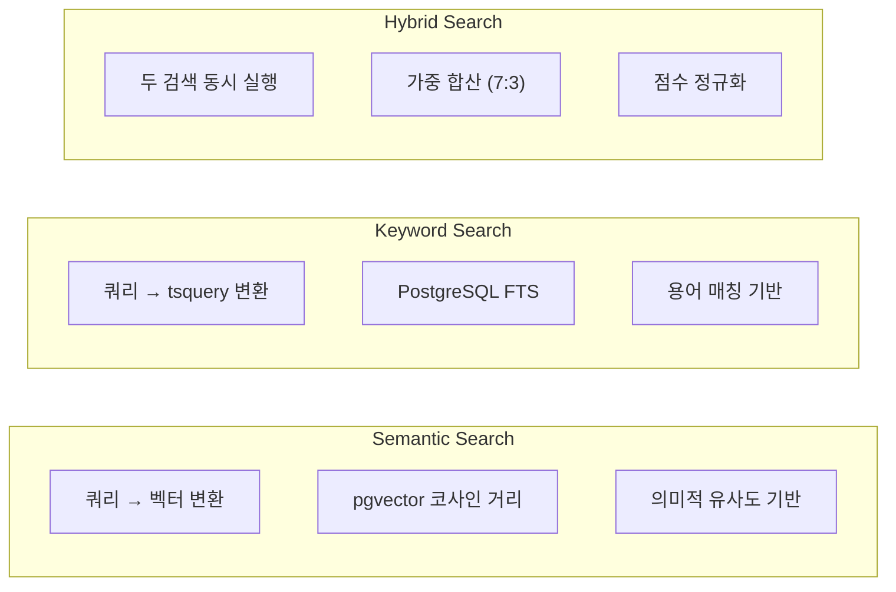

# 벡터 검색 파이프라인 분석

## 1. 검색 시스템 개요

LangConnect는 세 가지 검색 유형을 지원한다: Semantic (벡터 유사도), Keyword (전문 검색), Hybrid (결합 검색). 모든 검색은 `Collection.search()` 메서드에서 처리된다.



> **참조**: `langconnect/database/collections.py` 라인 640-907, 검색 API 엔드포인트는 `langconnect/api/documents.py` 라인 226-248

---

## 2. 검색 요청 모델

### 2.1 SearchQuery (요청)

```python
# langconnect/models/document.py (라인 23-27)
class SearchQuery(BaseModel):
    query: str                                                    # 검색 쿼리 문자열
    limit: int | None = 10                                       # 최대 결과 수
    filter: dict[str, Any] | None = None                         # 메타데이터 필터
    search_type: Literal["semantic", "keyword", "hybrid"] = "semantic"  # 검색 유형
```

### 2.2 SearchResult (응답)

```python
# langconnect/models/document.py (라인 30-34)
class SearchResult(BaseModel):
    id: str                                    # 문서 청크 ID
    page_content: str                          # 문서 내용
    metadata: dict[str, Any] | None = None     # 메타데이터
    score: float                               # 관련도 점수 (0~1)
```

### 2.3 API 엔드포인트

```
POST /collections/{collection_id}/documents/search
Content-Type: application/json

{
    "query": "검색할 내용",
    "limit": 10,
    "search_type": "hybrid",
    "filter": {"source": "paper.pdf"}
}
```

> **참조**: `langconnect/api/documents.py` 라인 226-248

---

## 3. Semantic Search (벡터 유사도 검색)

### 3.1 동작 원리

쿼리 텍스트를 임베딩 벡터로 변환한 후, PostgreSQL pgvector의 거리 기반 유사도 검색을 수행한다.



### 3.2 거리-유사도 변환

PGVector의 `similarity_search_with_score`는 **거리(distance)**를 반환한다 (낮을수록 유사). 이를 0~1 범위의 유사도 점수로 변환한다:

```
similarity = 1 / (1 + distance)
```

| distance | similarity | 해석 |
|----------|------------|------|
| 0 | 1.0 | 완벽히 동일 |
| 0.5 | 0.667 | 매우 유사 |
| 1.0 | 0.5 | 중간 |
| 2.0 | 0.333 | 낮은 유사도 |
| infinity | 0 | 완전히 다름 |

```python
# langconnect/database/collections.py (라인 699-707)
formatted_results = [
    {
        "id": doc.id,
        "page_content": doc.page_content,
        "metadata": doc.metadata,
        "score": 1 / (1 + distance),  # 거리를 유사도로 변환
    }
    for doc, distance in results
]
```

### 3.3 필터 적용 시 over-fetch

메타데이터 필터가 있으면 `limit * 3`개의 결과를 먼저 가져온 후 필터링한다:

```python
# langconnect/database/collections.py (라인 692)
k = limit * 3 if filter else limit
results = store.similarity_search_with_score(query, k=k)
```

> **참조**: `langconnect/database/collections.py` 라인 688-713

---

## 4. Keyword Search (전문 검색)

### 4.1 동작 원리

PostgreSQL의 전문 검색(Full-Text Search) 기능을 사용한다. `to_tsvector`와 `plainto_tsquery`를 활용하여 텍스트 매칭을 수행하고, `ts_rank`로 관련도를 계산한다.



### 4.2 SQL 쿼리 상세

```sql
-- langconnect/database/collections.py (라인 723-740)
SELECT e.id as id,
       e.document as page_content,
       e.cmetadata as metadata,
       ts_rank(
           to_tsvector('english', e.document),
           plainto_tsquery('english', $1)
       ) as score
FROM langchain_pg_embedding e
JOIN langchain_pg_collection c ON e.collection_id = c.uuid
WHERE c.uuid = $2
  AND to_tsvector('english', e.document) @@ plainto_tsquery('english', $1)
ORDER BY score DESC
LIMIT $3
```

**핵심 요소**:

| 함수 | 역할 |
|------|------|
| `to_tsvector('english', document)` | 문서 텍스트를 영어 어간 분석을 적용한 tsvector로 변환 |
| `plainto_tsquery('english', query)` | 검색 쿼리를 평문에서 tsquery로 변환 |
| `@@` 연산자 | tsvector와 tsquery 간 매칭 여부 확인 |
| `ts_rank()` | 매칭된 문서의 관련도 점수 계산 |

**언어 설정**: `'english'`로 고정되어 있어 영어 문서에 최적화되어 있다. 한국어 등 다른 언어의 문서에서는 형태소 분석이 적용되지 않는다.

### 4.3 점수 체계

`ts_rank`는 0~1 범위의 점수를 반환하지만 정확한 범위는 보장되지 않는다. 점수는 쿼리 용어의 문서 내 빈도, 위치 등을 기반으로 계산된다.

> **참조**: `langconnect/database/collections.py` 라인 715-776

---

## 5. Hybrid Search (하이브리드 검색)

### 5.1 전체 흐름

Semantic과 Keyword 검색을 동시에 수행한 후, 가중 합산으로 최종 점수를 계산한다.



### 5.2 상세 스코어링 알고리즘

#### 단계 1: Semantic 결과 처리

Semantic 검색 결과의 거리를 유사도로 변환하고, 70% 가중치를 적용한다:

```python
# langconnect/database/collections.py (라인 830-841)
for doc, distance in semantic_results:
    similarity_score = 1 / (1 + distance)
    combined_results[doc.id] = {
        "id": doc.id,
        "page_content": doc.page_content,
        "metadata": doc.metadata,
        "semantic_score": similarity_score,
        "keyword_score": 0,
        "combined_score": similarity_score * 0.7,  # 70% 가중치
    }
```

#### 단계 2: Keyword 결과 처리 및 정규화

Keyword 검색 결과의 `ts_rank` 점수를 최대값 기준으로 0~1 범위로 정규화한 후, 30% 가중치를 적용한다:

```python
# langconnect/database/collections.py (라인 844-874)
if keyword_rows:
    max_keyword_score = max(
        (float(row["score"]) for row in keyword_rows), default=1.0
    )
    for row in keyword_rows:
        doc_id = str(row["id"])
        normalized_score = (
            float(row["score"]) / max_keyword_score
            if max_keyword_score > 0
            else 0
        )

        if doc_id in combined_results:
            # 이미 Semantic 결과에 있는 문서: 점수 업데이트
            combined_results[doc_id]["keyword_score"] = normalized_score
            combined_results[doc_id]["combined_score"] = (
                combined_results[doc_id]["semantic_score"] * 0.7
                + normalized_score * 0.3
            )
        else:
            # Keyword에서만 발견된 새 문서
            combined_results[doc_id] = {
                "id": doc_id,
                "page_content": row["page_content"],
                "metadata": json.loads(row["metadata"]) if row["metadata"] else {},
                "semantic_score": 0,
                "keyword_score": normalized_score,
                "combined_score": normalized_score * 0.3,
            }
```

#### 단계 3: 최종 점수 정규화

결과 유형에 따라 최종 점수를 0~1 범위로 정규화한다:



```python
# langconnect/database/collections.py (라인 877-897)
for result in combined_results.values():
    combined_score = result["combined_score"]

    if result["keyword_score"] == 0:  # semantic-only
        final_score = combined_score / 0.7
    elif result["semantic_score"] == 0:  # keyword-only
        final_score = combined_score / 0.3
    else:  # hybrid (둘 다 매칭)
        final_score = combined_score

    all_results.append({
        "id": result["id"],
        "page_content": result["page_content"],
        "metadata": result["metadata"],
        "score": final_score,
    })
```

### 5.3 스코어링 예시

다음은 가상의 검색 결과에 대한 스코어 계산 예시이다:

| 문서 | semantic_score | keyword_score (정규화) | combined_score | 유형 | final_score |
|------|---------------|----------------------|----------------|------|-------------|
| Doc A | 0.85 | 0.90 | 0.85*0.7 + 0.90*0.3 = 0.865 | hybrid | **0.865** |
| Doc B | 0.72 | 0 | 0.72*0.7 = 0.504 | semantic-only | 0.504/0.7 = **0.720** |
| Doc C | 0 | 1.00 | 1.00*0.3 = 0.300 | keyword-only | 0.300/0.3 = **1.000** |
| Doc D | 0.60 | 0.50 | 0.60*0.7 + 0.50*0.3 = 0.570 | hybrid | **0.570** |

**정규화 결과 해석**:
- Semantic-only 결과: 원래의 semantic_score 값이 복원된다 (0.504 / 0.7 = 0.72).
- Keyword-only 결과: 원래의 정규화된 keyword_score 값이 복원된다 (0.300 / 0.3 = 1.00).
- Hybrid 결과: 가중 합산 점수가 그대로 사용된다.

### 5.4 가중치 설정

| 검색 유형 | 가중치 | 근거 |
|-----------|--------|------|
| Semantic | **70%** | 자연어 쿼리의 의미적 유사도를 우선 |
| Keyword | **30%** | 정확한 용어 매칭을 보완적으로 반영 |

> **참조**: 가중치는 코드에 하드코딩되어 있다 (`langconnect/database/collections.py` 라인 841, 859-862). 현재 동적 조정 기능은 없다.

### 5.5 Over-fetch 전략

Hybrid 검색에서 두 검색 모두 `limit * 2`개의 결과를 가져온다:

```python
# langconnect/database/collections.py (라인 781)
semantic_results = store.similarity_search_with_score(query, k=limit * 2)

# 라인 804
keyword_rows = await conn.fetch(..., limit * 2)
```

이는 두 검색의 결합과 중복 제거 후에도 충분한 결과를 확보하기 위함이다.

---

## 6. 메타데이터 필터링

### 6.1 필터 적용 방식

모든 검색 유형에서 동일한 방식으로 메타데이터 필터가 적용된다. 필터는 **애플리케이션 레벨**에서 수행된다 (SQL WHERE 절이 아닌 결과 후처리).

```python
# langconnect/database/collections.py (라인 668-686)
def apply_metadata_filter(
    results: list[dict[str, Any]], filter_dict: dict[str, Any]
) -> list[dict[str, Any]]:
    if not filter_dict:
        return results

    filtered_results = []
    for result in results:
        result_metadata = result.get("metadata", {})
        match = True
        for key, value in filter_dict.items():
            if key not in result_metadata or result_metadata[key] != value:
                match = False
                break
        if match:
            filtered_results.append(result)
    return filtered_results
```

### 6.2 필터 동작 특성

| 특성 | 설명 |
|------|------|
| 매칭 방식 | 정확 일치 (exact match) |
| 다중 조건 | AND 논리 (모든 조건 충족 필요) |
| 적용 시점 | 검색 결과 반환 후 애플리케이션에서 필터링 |
| Over-fetch | 필터 사용 시 `limit * 3` (semantic/keyword) 또는 `limit * 2` (hybrid) |

### 6.3 필터 사용 예시

```json
{
    "query": "machine learning",
    "search_type": "hybrid",
    "filter": {
        "source": "paper.pdf",
        "file_id": "abc123"
    }
}
```

위 필터는 `metadata.source == "paper.pdf"` AND `metadata.file_id == "abc123"`인 결과만 반환한다.

---

## 7. Multi-Query 검색

### 7.1 개요

단일 질문에서 3~5개의 대안 쿼리를 LLM으로 생성하여 검색 커버리지를 확대하는 기능이다. MCP 도구로만 제공된다 (REST API 엔드포인트 없음).



### 7.2 구현 상세

```python
# mcpserver/mcp_server.py (라인 730-753)
from langchain_openai import ChatOpenAI
llm = ChatOpenAI(model="gpt-5-nano", api_key=OPENAI_API_KEY)

query_prompt = PromptTemplate(
    input_variables=["question"],
    template="""You are an AI language model assistant. Your task is to generate 3 to 5
different versions of the given user question to retrieve relevant documents from a vector
database. By generating multiple perspectives on the user question, your goal is to help
the user overcome some of the limitations of the distance-based similarity search.
Provide these alternative questions separated by newlines. Do not number them.
Original question: {question}""",
)

output_parser = LineListOutputParser()
chain = query_prompt | llm | output_parser
queries = await chain.ainvoke({"question": question})
```

### 7.3 LineListOutputParser

LLM 출력을 줄 단위로 분리하여 쿼리 리스트로 변환한다:

```python
# mcpserver/mcp_server.py (라인 92-98)
class LineListOutputParser(BaseOutputParser[list[str]]):
    def parse(self, text: str) -> list[str]:
        lines = [line.strip() for line in text.strip().split("\n")]
        return [line for line in lines if line]
```

### 7.4 RAG 프롬프트

stdio MCP 서버에는 RAG 워크플로우를 안내하는 프롬프트 템플릿이 등록되어 있다:

```python
# mcpserver/mcp_server.py (라인 48-88)
@mcp.prompt("rag-prompt")
async def rag_prompt(query: str) -> list[dict]:
    # 시스템 프롬프트에서 권장하는 검색 가이드라인:
    # 1. list_collections로 컬렉션 찾기
    # 2. multi_query로 3개 이상 하위 질문 생성
    # 3. 생성된 모든 쿼리로 검색 수행
    # 4. 검색 결과로 답변 작성
```

권장 검색 설정:
- **검색 유형**: `hybrid` (선호)
- **검색 제한**: 5개 (기본)

> **참조**: `mcpserver/mcp_server.py` 라인 48-88, 699-757

---

## 8. 검색 파라미터 요약

### 8.1 Collection.search() 매개변수

| 매개변수 | 타입 | 기본값 | 범위 | 설명 |
|----------|------|--------|------|------|
| `query` | `str` | 필수 | - | 검색 쿼리 문자열 |
| `limit` | `int` | `4` | 1~100 | 최대 반환 결과 수 |
| `search_type` | `Literal` | `"semantic"` | semantic, keyword, hybrid | 검색 알고리즘 |
| `filter` | `dict` | `None` | - | 메타데이터 필터 (exact match) |

> **참조**: `langconnect/database/collections.py` 라인 640-647

### 8.2 MCP search_documents() 매개변수

| 매개변수 | 타입 | 기본값 | 설명 |
|----------|------|--------|------|
| `collection_id` | `str` | 필수 | 컬렉션 UUID |
| `query` | `str` | 필수 | 검색 쿼리 |
| `limit` | `int` | `5` | 최대 결과 수 |
| `search_type` | `str` | `"semantic"` | 검색 유형 |
| `filter_json` | `str \| None` | `None` | 메타데이터 필터 (JSON 문자열) |

> **참조**: `mcpserver/mcp_server.py` 라인 157-165

### 8.3 임베딩 모델 설정

| 항목 | 값 |
|------|-----|
| 모델 | `neuml/pubmedbert-base-embeddings` |
| 벡터 차원 | 768 |
| 디바이스 | CPU |
| 정규화 | L2 정규화 활성화 |
| 거리 측정 | Cosine Distance (PGVector 기본값) |

> **참조**: `langconnect/config.py` 라인 17-26

---

## 9. 검색 유형별 비교



| 항목 | Semantic | Keyword | Hybrid |
|------|----------|---------|--------|
| **검색 엔진** | PGVector (pgvector) | PostgreSQL FTS | PGVector + PostgreSQL FTS |
| **쿼리 처리** | 벡터 임베딩 변환 | tsquery 변환 | 양쪽 모두 |
| **매칭 방식** | 코사인 거리 유사도 | 어간 분석 텍스트 매칭 | 가중 결합 |
| **언어 지원** | 모든 언어 (임베딩 모델 의존) | 영어 (english 사전 고정) | 양쪽 결합 |
| **장점** | 유의어, 의미 파악 | 정확한 용어 매칭 | 양쪽 장점 결합 |
| **단점** | 정확한 용어 놓칠 수 있음 | 의미적 유사성 미반영 | 2배 연산 비용 |
| **over-fetch** | limit * 3 (필터 시) | limit * 3 (필터 시) | limit * 2 (항상) |
| **점수 범위** | 0~1 | ts_rank 원본 | 0~1 (정규화) |
| **권장 사용** | 자연어 질문 | 정확한 키워드 | 종합 검색 (MCP 기본 권장) |

---

## 10. 사용자별 검색 격리

검색 시 `user_id`가 설정된 경우 SQL 쿼리에 소유자 검증 조건이 추가된다:

```sql
-- Keyword/Hybrid 검색 시 사용자 필터 (user_id가 있는 경우)
AND c.cmetadata->>'owner_id' = $3
```

현재 API 엔드포인트에서는 `user_id=None`으로 호출되어 모든 사용자의 데이터를 검색할 수 있다.

> **참조**: `langconnect/database/collections.py` 라인 721-741 (keyword), 라인 785-805 (hybrid)

---

## 11. 검색 결과 형식

### 11.1 REST API 응답

```json
[
    {
        "id": "chunk-uuid-1",
        "page_content": "문서 내용...",
        "metadata": {
            "file_id": "file-uuid",
            "source": "document.pdf",
            "format": "markdown",
            "parser": "PyMuPDF4LLMParser"
        },
        "score": 0.865
    }
]
```

### 11.2 MCP stdio 서버 응답 (JSON 형식)

```json
{
    "results": [
        {
            "content": "문서 내용...",
            "metadata": {"file_id": "...", "source": "..."},
            "score": 0.865,
            "id": "chunk-uuid-1"
        }
    ],
    "count": 1,
    "search_type": "hybrid"
}
```

> **참조**: `mcpserver/mcp_server.py` 라인 201-216. MCP stdio 서버는 `page_content` 대신 `content` 키를 사용한다.

### 11.3 MCP SSE 서버 응답 (Markdown 형식)

```markdown
## Search Results (hybrid)

### Result 1 (Score: 0.8650)
문서 내용...
Document ID: chunk-uuid-1
```

> **참조**: `mcpserver/mcp_sse_server.py` 라인 240-246. SSE 서버는 Markdown 형식의 텍스트를 반환한다.
